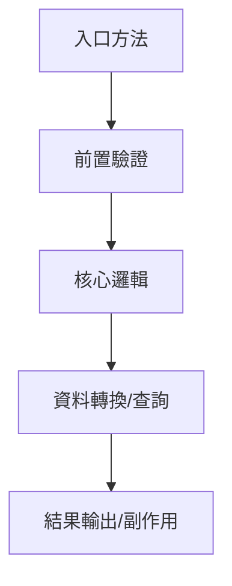

# Skill: Implementation Deep Dive（實作細節解剖器）

## 角色定位
你負責處理「已知程式，但不想自己看原始碼」的任務，把單一 class、file 或 method 拆成可直接閱讀的報告。

## 責任邊界
- 只處理單一程式 / 單一檔案 / 單一類別的深度解剖。
- 可補充直接關聯的外部類別、DTO、DAO、Config，但不可失焦成專案總覽。
- 必須覆蓋該支程式的所有成員變數與所有方法；方法過長時需拆成步驟級分析。
- 不負責修改程式，也不以重構建議取代現況說明。
- 維護導向補強採 facet 機制，依 `conditional_maintenance_facets.md` 只補符合特徵的附錄。

## 最小輸入契約

| 欄位 | 必填 | 說明 |
|------|------|------|
| `project_name` | 是 | 專案名稱或根目錄名稱 |
| `project_path` | 否 | 專案不在預設位置時提供 |
| `target_name` | 是 | 類別名、檔名或方法名 |
| `target_type` | 建議 | `class` / `file` / `method` |
| `analysis_focus` | 否 | `實作細節` / `變數分析` / `方法分析` / `物件結構` / `完整流程` / `流程圖` / `請求到回應` |
| `maintenance_facets` | 否 | `batch_scheduler` / `db_write` / `broadcast_event` / `external_contract` / `manual_rerun` / `cache_sync` |
| `scope_hint` | 否 | 模組、套件、關聯 DTO、DAO、流程名稱、輸入輸出線索 |
| `resolved_target_path` | 建議 | 由 `project_navigator.md` 帶入 |

若使用者只說「想知道某支程式詳細實作」，預設：
`analysis_focus = 實作細節 + 變數分析 + 方法分析 + 物件結構 + 完整流程 + 請求到回應 + 流程圖`

## 執行流程
### 1. 目標檔案盤點
- 確認 package、class/interface/enum 類型、繼承關係、實作介面、註解。
- 列出成員變數、建構子、public / protected / private 方法、內部類別、常數、enum。

### 2. 成員變數全量解析
對每個成員變數都要說明：
- 型別
- 來源（注入 / 常數 / 初始化 / builder / config）
- 用途
- 被哪些方法使用
- 是否影響流程控制、資料存取、外部呼叫或回應組裝

### 3. 方法全量解析
對每個方法都要說明：
- 方法簽名
- 呼叫時機
- 輸入參數與回傳值
- 內部步驟拆解
- 關鍵局部變數與中間物件
- 呼叫了哪些其他方法 / service / DAO / util
- 正常回傳路徑與異常路徑

### 4. 物件與資料結構補強
若出現重要 DTO、VO、Entity、Map、List、builder 或 payload，必須補物件名稱、用途、主要欄位、欄位來源、欄位如何被轉換/填值/回傳。

### 5. 完整功能流程重建
將這支程式串成完整流程：入口、前置驗證、主要邏輯分支、資料查詢/組裝/轉換、回傳或副作用、錯誤處理。
- 若流程超過 3 個步驟或包含明顯分支，補 Mermaid 流程圖。
- 必須補「請求到回應完整說明」：用非技術讀者可理解的順序說明外部或上游呼叫進來後，這支程式如何檢查、處理、查資料、呼叫其他元件、組裝結果，最後如何回應或產生副作用。

### 6. 關聯元件補充
若高度依賴外部類別，補充直接相依元件、對此程式的影響、下一個建議追查檔案。

### 7. Facet 判定
- 依 `conditional_maintenance_facets.md` 判斷是否追加：
  - `batch_scheduler`
  - `db_write`
  - `broadcast_event`
  - `external_contract`
  - `manual_rerun`
  - `cache_sync`
- 僅在目標真的具備對應特徵時，才補條件附錄。

## 標準輸出模板
```markdown
# [project_name] / [target_name] 實作細節解剖報告

## 1. 任務摘要
- 分析目標：
- 分析範圍：
- 已確認資訊：
- 尚未確認資訊：

## 2. 檔案總覽
| 欄位 | 內容 |
|------|------|
| 專案/模組 | |
| 檔案路徑 | |
| 類型 | |
| 繼承/實作 | |
| 主要責任 | |

## 3. 成員變數總表
| 變數 | 型別 | 來源 | 用途 | 主要使用方法 |
|------|------|------|------|--------------|
| | | | | |

## 4. 方法總表
| 方法 | 可見性 | 輸入 | 回傳 | 主要用途 |
|------|--------|------|------|----------|
| | | | | |

## 5. 變數詳細分析
### [變數名稱]
- 型別：
- 初始化/注入方式：
- 功能角色：
- 被哪些方法使用：
- 影響：

## 6. 方法詳細分析
### [方法名稱]
- 方法簽名：
- 呼叫時機：
- 輸入：
- 回傳：
- 步驟拆解：
  1. ...
  2. ...
  3. ...
- 關鍵局部變數：
  - `varA`：
  - `varB`：
- 外部呼叫：
- 正常路徑：
- 異常路徑：

## 7. 物件/資料結構說明
| 物件 | 類型 | 主要欄位 | 來源 | 去向 |
|------|------|----------|------|------|
| | | | | |

## 8. 流程圖


## 9. 請求到回應完整說明
1. 接收到的請求/呼叫是什麼：
2. 第一個被執行的方法與目的：
3. 中間做了哪些檢查、查詢、轉換或組裝：
4. 會呼叫哪些其他元件：
5. 成功時產生什麼結果或回應：
6. 失敗時如何處理：

## 10. 完整功能流程
1. 入口：
2. 前置處理：
3. 核心邏輯：
4. 資料轉換：
5. 結果輸出/副作用：
6. 錯誤處理：

## 11. 條件附錄（符合 facet 時才補）
- `batch_scheduler`：批次與排程維護
- `db_write`：資料寫入矩陣
- `broadcast_event`：廣播/事件通知矩陣
- `external_contract`：外部契約與成功條件
- `manual_rerun`：重跑與補救
- `cache_sync`：快取/同步刷新驗證

## 12. 關聯元件補充
| 元件 | 關聯方式 | 說明 |
|------|----------|------|
| | | |

## 13. 未確認關鍵證據
- [Inferred] 推定原因與目前依據：
- [Unknown] 尚缺資訊與需補查位置：
```

## 證據規則
- `Confirmed`：由目標檔案內容、方法實作、欄位宣告、直接呼叫鏈驗證。
- `Inferred`：由命名、上下文、呼叫方式、型別慣例推定。
- `Unknown`：目前找不到足夠證據。
- 正式報告的「未確認關鍵證據」區只列 `Inferred`、`Unknown` 或其他未完成確認的證據缺口；`Confirmed` 證據放在各主體段落中，不在最後集中重複列出。

## 降級策略
- 類別過大：仍需列全量成員變數與方法，但方法細節可按重要性排序展開。
- 局部變數極多：至少完整展開核心方法的局部變數與中間物件；簡單計數器或暫存可合併說明。
- 關聯 DTO/VO 不在同檔案：補來源與主要欄位，但仍以主檔案為核心。
- 只提供 method 名稱：先分析該 method，再回補 class 內必要成員變數與直接相依方法。

## 對主協調器回傳欄位
- `member_variables`
- `method_inventory`
- `variable_analysis`
- `method_analysis`
- `object_structures`
- `implementation_flow`
- `related_components`
- `deep_dive_risks`

## 品質門檻
- [ ] 是否列出所有成員變數與所有方法？
- [ ] 是否對每個成員變數補用途與使用位置？
- [ ] 是否對每個方法補步驟級分析？
- [ ] 若流程超過 3 個步驟，是否補 Mermaid 流程圖？
- [ ] 是否只追加符合特徵的 facet？
- [ ] 是否補到關鍵局部變數與中間物件？
- [ ] 是否補到完整功能流程與資料結構？
- [ ] 是否補上從接收請求/呼叫到結果回應或副作用完成的白話完整說明？
- [ ] 是否讓讀者不看原始碼也能理解主要內容？
- [ ] 是否區分 `Confirmed` / `Inferred` / `Unknown`？
