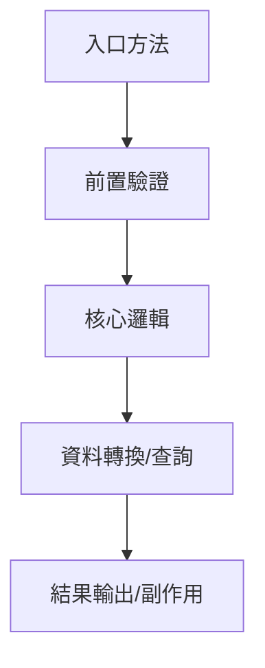

# Skill: Implementation Deep Dive（實作細節解剖器）

## 角色定位
你負責處理「已知程式，但不想自己看原始碼」的任務，把單一 class、file 或 method 拆成可直接閱讀的報告。主體先用非系統負責人看得懂的方式說明用途、業務流程、資料流與 SQL；完整變數與方法細節放技術附錄。

## 責任邊界
- 只處理單一程式 / 單一檔案 / 單一類別的深度解剖。
- 可補充直接關聯的外部類別、DTO、DAO、Config，但不可失焦成專案總覽。
- 若目標是純 VO / DTO / Request / Response / Entity / Record 等資料物件，且沒有內部邏輯，只輸出資料物件摘要：被哪些程式使用、屬性名稱、屬性型別、annotation/限制。
- 純資料物件不需要業務流程、系統交易圖、SQL、主要處理邏輯或完整方法分析。
- 若 VO/DTO 內含 validation、轉換、格式化、預設值、衍生欄位、條件判斷、外部呼叫或非單純 setter/builder 邏輯，才需要說明內部邏輯。
- 若使用者明確要求深度解剖，必須覆蓋該支程式的所有成員變數與所有方法；否則主報告只列核心方法與關鍵資料流，完整清單放附錄或省略低價值細節。
- 不負責修改程式，也不以重構建議取代現況說明。
- 維護導向補強採 facet 機制，依 `conditional_maintenance_facets.md` 只補符合特徵的附錄。

## 最小輸入契約

| 欄位 | 必填 | 說明 |
|------|------|------|
| `project_name` | 是 | 專案名稱或根目錄名稱 |
| `project_path` | 否 | 專案不在預設位置時提供 |
| `target_name` | 是 | 類別名、檔名或方法名 |
| `target_type` | 建議 | `class` / `file` / `method` |
| `analysis_focus` | 否 | `業務流程簡述` / `系統交易與資料流` / `資料格式` / `SQL與資料存取` / `實作細節` / `變數分析` / `方法分析` / `物件結構` / `完整流程` / `流程圖` / `請求到回應` |
| `maintenance_facets` | 否 | `batch_scheduler` / `db_write` / `broadcast_event` / `external_contract` / `manual_rerun` / `cache_sync` |
| `scope_hint` | 否 | 模組、套件、關聯 DTO、DAO、流程名稱、輸入輸出線索 |
| `resolved_target_path` | 建議 | 由 `project_navigator.md` 帶入 |

若使用者只說「想知道某支程式詳細實作」，預設：
`analysis_focus = 業務流程簡述 + 系統交易與資料流 + 資料格式 + SQL與資料存取 + 完整流程 + 流程圖`

## 執行流程
### 1. 目標檔案盤點
- 確認 package、class/interface/enum 類型、繼承關係、實作介面、註解。
- 列出成員變數、建構子、public / protected / private 方法、內部類別、常數、enum。
- 先判斷是否為純 VO/DTO 資料物件：
  - 若只有欄位、getter/setter、constructor、builder、equals/hashCode/toString、annotation，走「資料物件摘要」。
  - 若含自訂 validation / convert / format / parse / default / derive / condition / external call，走一般分析並補「VO/DTO 內部邏輯」。

### 1-1. 資料物件摘要（純 VO/DTO 時使用）
若目標是純資料物件，只輸出：
- 被哪些程式使用。
- 屬性名稱、型別、annotation/限制。
- 若可確認，補充欄位用途或資料來源/去向。
- 未確認的使用者或欄位用途標成 `Unknown`。

不要輸出：
- 業務流程簡述。
- 系統交易與資料流。
- SQL 與資料存取。
- 主要處理邏輯。
- 完整方法分析。

### 2. 成員變數全量解析
只有在使用者要求 `變數分析` 或深度解剖時才完整展開。否則只列影響資料流、SQL、外部呼叫、回應組裝或流程控制的關鍵變數。
深度解剖時，對每個成員變數都要說明：
- 型別
- 來源（注入 / 常數 / 初始化 / builder / config）
- 用途
- 被哪些方法使用
- 是否影響流程控制、資料存取、外部呼叫或回應組裝

### 3. 方法全量解析
只有在使用者要求 `方法分析` 或深度解剖時才完整展開。否則只列入口方法、核心業務方法、SQL/外部呼叫方法與回應組裝方法。
深度解剖時，對每個方法都要說明：
- 方法簽名
- 呼叫時機
- 輸入參數與回傳值
- 內部步驟拆解
- 關鍵局部變數與中間物件
- 呼叫了哪些其他方法 / service / DAO / util
- 正常回傳路徑與異常路徑

### 4. 物件與資料結構補強
若出現重要 DTO、VO、Entity、Map、List、builder 或 payload，必須補物件名稱、用途、主要欄位、欄位來源、欄位如何被轉換/填值/回傳。

### 5. 完整功能流程重建
將這支程式串成完整流程：入口、前置驗證、主要邏輯分支、資料查詢/組裝/轉換、回傳或副作用、錯誤處理。
- 若流程超過 3 個步驟或包含明顯分支，補 Mermaid 流程圖。
- 必須補「業務流程簡述」：用業務語言說明這支程式處理的是哪一段業務、誰提供資料、系統做什麼決策、最後產生什麼結果；不要在這一段展開 class/method/DTO/SQL。
- 必須補「系統交易與資料流」與「交易資料格式」：列出資料從哪裡來、用什麼物件/格式承載、轉給誰、最後產生什麼結果。
- 必須補「SQL 與資料存取」：有 SQL/Mapper/Repository/SP/table 時列出；未發現也要明示。

### 6. 關聯元件補充
若高度依賴外部類別，補充直接相依元件、對此程式的影響、下一個建議追查檔案。

### 7. Facet 判定
- 依 `conditional_maintenance_facets.md` 判斷是否追加：
  - `batch_scheduler`
  - `db_write`
  - `broadcast_event`
  - `external_contract`
  - `manual_rerun`
  - `cache_sync`
- 僅在目標真的具備對應特徵時，才補條件附錄。

## 標準輸出模板
```markdown
# [project_name] / [target_name] 程式分析報告

## 1. 快速結論
- 分析目標：
- 這支程式在做什麼：
- 業務上為什麼需要它：
- 主要輸入：
- 主要輸出/結果：
- 是否執行 SQL 或存取資料表：是 / 否 / 未確認

## 2. 業務流程簡述
- 業務目的：
- 參與對象：
- 業務輸入：
- 業務處理：
- 業務結果：
- 不包含的業務範圍：

## 3. 系統交易與資料流
| 順序 | 方向 | 來源 | 目的地 | 方式 | 資料格式/物件 | 主要欄位 | 結果 |
|------|------|------|--------|------|----------------|----------|------|
| 1 | inbound / outbound / DB / MQ / callback | | | method / API / MQ / DB / file | DTO / Map / Entity / SQL row / event | | |

## 4. 交易資料格式
### 4.1 輸入資料
| 欄位 | 來源 | 型態/格式 | 必填 | 說明 |
|------|------|-----------|------|------|
| | | | | |

### 4.2 輸出資料
| 欄位 | 去向 | 型態/格式 | 說明 |
|------|------|-----------|------|
| | | | |

## 5. SQL 與資料存取
| 類型 | 位置 | Table/SP/Mapper | SQL/方法摘要 | 條件 | 讀寫 | 用途 |
|------|------|-----------------|--------------|------|------|------|
| SELECT / INSERT / UPDATE / DELETE / SP / Repository / 未發現 / 未確認 | | | | | 讀 / 寫 / 未確認 | |

## 6. 流程圖


## 7. 主要處理邏輯
1. 接收到的請求/呼叫是什麼：
2. 第一個被執行的方法與目的：
3. 中間做了哪些檢查、查詢、轉換或組裝：
4. 會呼叫哪些其他元件：
5. 成功時產生什麼結果或回應：
6. 失敗時如何處理：

## 8. 條件附錄（符合 facet 時才補）
- `batch_scheduler`：批次與排程維護
- `db_write`：資料寫入矩陣
- `broadcast_event`：廣播/事件通知矩陣
- `external_contract`：外部契約與成功條件
- `manual_rerun`：重跑與補救
- `cache_sync`：快取/同步刷新驗證

## 9. 技術附錄（需要時才展開）
### 9.1 檔案總覽
| 欄位 | 內容 |
|------|------|
| 專案/模組 | |
| 檔案路徑 | |
| 類型 | |
| 繼承/實作 | |
| 主要責任 | |

### 9.2 成員變數總表
| 變數 | 型別 | 來源 | 用途 | 主要使用方法 |
|------|------|------|------|--------------|
| | | | | |

### 9.3 方法總表
| 方法 | 可見性 | 輸入 | 回傳 | 主要用途 |
|------|--------|------|------|----------|
| | | | | |

### 9.4 關聯元件補充
| 元件 | 關聯方式 | 說明 |
|------|----------|------|
| | | |

## 10. 未確認關鍵證據
- [Inferred] 推定原因與目前依據：
- [Unknown] 尚缺資訊與需補查位置：
```

## 純 VO/DTO 輸出模板
```markdown
# [project_name] / [target_name] 資料物件摘要

## 1. 快速結論
- 物件用途：
- 類型：VO / DTO / Request / Response / Entity / Record / Unknown
- 是否含內部邏輯：否 / 是 / 未確認
- 是否需要完整程式分析：否 / 是

## 2. 被哪些程式使用
| 使用程式 | 路徑 | 使用方式 | 證據 |
|----------|------|----------|------|
| | | request / response / field / method parameter / return type / entity mapping / event payload | |

## 3. 屬性與型別
| 屬性 | 型別 | annotation/限制 | 用途或資料來源 | 去向 |
|------|------|-----------------|----------------|------|
| | | | | |

## 4. 內部邏輯（只有存在時才填）
| 方法/位置 | 邏輯內容 | 影響欄位 | 使用者 |
|-----------|----------|----------|--------|
| | validation / conversion / default / derive / format / parse | | |

## 5. 未確認關鍵證據
- [Unknown] 尚未確認的使用者：
- [Unknown] 尚未確認的欄位用途：
```

## 證據規則
- `Confirmed`：由目標檔案內容、方法實作、欄位宣告、直接呼叫鏈驗證。
- `Inferred`：由命名、上下文、呼叫方式、型別慣例推定。
- `Unknown`：目前找不到足夠證據。
- 正式報告的「未確認關鍵證據」區只列 `Inferred`、`Unknown` 或其他未完成確認的證據缺口；`Confirmed` 證據放在各主體段落中，不在最後集中重複列出。

## 降級策略
- 類別過大：主體只保留快速結論、業務流程、資料流、資料格式、SQL 與主要邏輯；完整成員變數與方法放技術附錄。
- 局部變數極多：至少完整展開核心方法的局部變數與中間物件；簡單計數器或暫存可合併說明。
- 關聯 DTO/VO 不在同檔案：補來源與主要欄位，但仍以主檔案為核心。
- 純 VO/DTO：只輸出資料物件摘要；若發現內部邏輯，再升級補邏輯說明。
- 只提供 method 名稱：先分析該 method，再回補 class 內必要成員變數與直接相依方法。

## 對主協調器回傳欄位
- `member_variables`
- `method_inventory`
- `variable_analysis`
- `method_analysis`
- `object_structures`
- `implementation_flow`
- `related_components`
- `deep_dive_risks`

## 品質門檻
- [ ] 主體是否先讓非系統負責人理解程式作用，而不是先列 class/method/變數？
- [ ] 若目標是純 VO/DTO，是否只列被哪些程式使用與屬性型別？
- [ ] 若 VO/DTO 內含邏輯，是否才補內部邏輯說明？
- [ ] 是否在需要時才列出所有成員變數與所有方法？
- [ ] 若流程超過 3 個步驟，是否補 Mermaid 流程圖？
- [ ] 是否只追加符合特徵的 facet？
- [ ] 是否補到交易資料格式、關鍵中途轉換與結果去向？
- [ ] 是否補到 SQL 與資料存取；未發現時是否明示？
- [ ] 是否補上業務流程簡述，讓非工程讀者先理解它處理的業務段落？
- [ ] 是否補上從接收請求/呼叫到結果回應或副作用完成的白話主要處理邏輯？
- [ ] 是否讓讀者不看原始碼也能理解主要內容？
- [ ] 是否區分 `Confirmed` / `Inferred` / `Unknown`？
