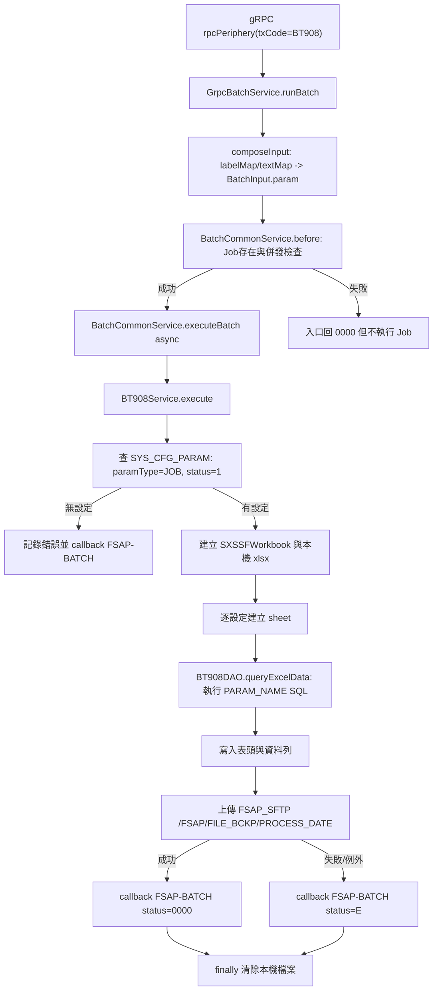

# fsap-common-service / BT908Service 分析報告

## 1. 任務摘要
- 分析目標：`BT908Service` flow，重點為用途、上下游、交易細節、路由鏈、資料契約、異常流與流程圖。
- 分析範圍：`fsap-adm/fsap-common-service` 的 gRPC 批次入口、`BT908Service`、`BT908DAO`、SQL XML、共用批次控管、檔案上傳、參數查詢與回呼 `FSAP-BATCH`。
- 已確認資訊：`BT908Service` 是 `@Service("BT908")` 的批次 Job，功能註解為「FSAP交易資料統計」，會產生 Excel、上傳到 `FSAP_SFTP`，再以 gRPC 通知 `FSAP-BATCH`。
- 尚未確認資訊：實際報表 SQL 內容存於 `SYS_CFG_PARAM.PARAM_NAME`，需查 DB 參數才能確認每張 sheet 查詢的 table、欄位與條件；`BT908_EMAIL` 的實際收件/通知欄位也需查 DB。

## 2. 目標定位
| 欄位 | 內容 |
|------|------|
| 專案/模組 | `fsap-adm/fsap-common-service` |
| 檔案路徑 | `fsap-adm/fsap-common-service/src/main/java/com/bot/fsap/service/BT908Service.java` |
| 類型/層級 | Spring Service / Batch Job / gRPC 批次 flow 節點 |
| 候選狀態 | 唯一命中：`@Service("BT908") public class BT908Service implements Job` |

## 3. 主要用途與角色
- 主要用途：依批次輸入參數中的 `JOB` 查詢啟用中的 `SYS_CFG_PARAM` 報表設定，逐筆建立 Excel sheet，將查詢結果寫入 `FSAP每日交易統計yyyyMMdd.xlsx`。
- 主角色：FSAP 每日交易統計報表產生器。
- 次角色：檔案備份/交付節點與批次完成通知節點，負責上傳 SFTP 後送 `BT001.BT908.I` gRPC 通知。
- 重要性：此 flow 的實際資料來源高度參數化；Java 程式負責流程、檔案與通知，DB 參數負責報表 SQL 內容。

## 4. 上游來源與路由鏈
- 上游來源：外部以 gRPC `rpcPeriphery` 呼叫 `fsap-common-service`，`RqHeader.txCode=BT908`。
- 入口總控：`GrpcBatchService.rpcPeriphery()` 於 switch case 中將 `BT908` 歸入 `runBatch()`。
- 分流條件：`runBatch()` 先 `composeInput()` 將 `labelMap`、`textMap` 合併為 `BatchInput.param`，再呼叫 `BatchCommonService.before()` 檢查 Job 是否存在與併發上限。
- 實際命中：`BatchCommonService.executeBatch()` 以 `jobs.get(jobInput.getJobId()).execute(jobInput)` 執行，因 `BT908Service` bean 名稱為 `BT908`，所以命中 `BT908Service.execute()`。

## 5. 下游去向與交易節點
- 下游系統/元件：
  - `SYS_CFG_PARAM`：查 `JOB` 對應報表設定與 `BT908_EMAIL` 通知文字。
  - `BT908DAO` / `NamedParameterJdbcTemplate`：執行參數化 SQL。
  - `FileService` / `FSAP_SFTP`：上傳 Excel 到 `/FSAP/FILE_BCKP/{PROCESS_DATE}`。
  - `FSAP-BATCH`：收到 BT908 完成/失敗 gRPC 通知。
- DB / SQL / SP：
  - `SYS_CFG_PARAM`：報表設定、通知設定、`FSAP_BT_PARAM/KINBR`。
  - `RT_CTRL`：取 `syssyncno`、`branchsyncno` 組 gRPC header。
  - `MSGID_MP`：以 `E89002` 查錯誤訊息模板。
  - `JOB_PRCS_CTL`、`CFG_JOB_INFO`：由共用批次流程寫入/更新批次狀態與檢查併發。
  - `USP_TX_SEQ`：`CommonService.getTxSeq()` 產生 `x_bot_client_seq`。
- 事件 / MQ / callback：未發現 MQ 發送；有 gRPC callback 到 `FSAP-BATCH`。
- 交易觸點：入站 `BT908`，出站 `BT001` + `DSCPT=BT908` + `TXCODE_FMTID=BT001.BT908.I`。

## 6. 資料契約與物件結構
- 入口參數 / Request：
  - `PeripheryRequest.apheader.xBotRequestId`：寫入 thread local 並沿用到 log 與 callback。
  - `RqHeader.txCode`：需為 `BT908` 才進入此 Job。
  - `RqHeader.arrayAttr.labelMap` / `textMap`：會合併到 `BatchInput.param`。
  - `BatchInput.param` 必用鍵：`JOB`、`PROCESS_DATE`、`WFL`；通知 label 會讀 `BTNNO`。
- 關鍵 header / payload：
  - 入站 `txCode=BT908`。
  - 出站 `xBotClientId=FSAP-COMMON-SERVICE`、`xBotServerId=FSAP-BATCH`、`xBotRtBatchFlag=S`。
  - 出站 `RqHeader.txCode=BT001`、`dscpt=BT908`、`txcodeFmtid=BT001.BT908.I`。
- 中途轉換物件：
  - `SysCfgParamEntity.paramCode`：Excel sheet 名稱。
  - `SysCfgParamEntity.paramName`：實際 SQL 內容，放入 `params.content` 後由 `BT908SQL.xml` 的 `$content` 展開。
  - `Map<String,Object>`：DAO 回傳每列資料，所有 row key 合併成 Excel 表頭。
  - `FileInfoVO`：先保存本機檔案名稱與路徑，再改成遠端 `fileId=FSAP_SFTP`、`filePath=/FSAP/FILE_BCKP/{PROCESS_DATE}`。
- 回應物件 / 輸出欄位：
  - 入口 gRPC 立即回 `PeripheryResponse.xBotStatus=0000` 表示已受理批次。
  - Job 結束後再送 callback：`labelMap` 包含 `HOSTNAME`、`BTNNO`、`STATUS`、`MSG`；`textMap` 包含 `FILENAME`、`NOTIFYTITLE` 與 `BT908_EMAIL` 參數。

## 7. 流程圖

## 8. 正常流
1. 入口：`GrpcBatchService` 收到 `txCode=BT908` 後走 `runBatch()`，組出 `BatchInput`。
2. 前置處理：`BatchCommonService.before()` 確認 Job bean 存在，讀 `CFG_JOB_INFO.JOB_CONCURRENCY`，檢查 `JOB_PRCS_CTL` 中執行中筆數，並寫入一筆執行中狀態。
3. 核心邏輯：`BT908Service.execute()` 讀取 `WFL`、`PROCESS_DATE`、`JOB`，再查 `SYS_CFG_PARAM` 取得報表 sheet 設定。
4. 資料查詢/轉換：每筆設定建立一張 sheet，將 `paramName` 當 SQL，搭配 `prcDate` 等命名參數查詢，依 row key 建表頭與資料列；字串超過 500 字元會截斷加 `...`。
5. 回傳/副作用：工作簿寫成本機 xlsx，上傳 SFTP，成功後用 `BT001.BT908.I` 通知 `FSAP-BATCH`，最後清除本機檔案。

## 9. 異常流
- 錯誤觸發點：
  - 查無報表設定：`runDataList` 為空，記錄「無FSAP報表資料設定」並 callback 失敗。
  - SQL 語法錯誤：捕捉 `BadSqlGrammarException`，抽取 Oracle `ORA-xxxxx` 訊息，呼叫 `ErrHndlService` 產生 `E89002` 訊息，該 sheet 寫入「請檢查 SQL 語法」。
  - SQL 命名參數缺漏：捕捉 `InvalidDataAccessApiUsageException`，從例外訊息解析第一個 key，呼叫 `E89002`，sheet 寫入錯誤訊息。
  - 其他 sheet 例外：呼叫 `E89002` 後重新拋出，外層再 callback 失敗。
  - SFTP 上傳失敗：`uploadLargeFileReTry3()` 最多初始 1 次加 3 次 retry；失敗時 callback `STATUS=E`。
  - callback gRPC timeout/例外：`sendGrpcToBatch()` 會重新拋出，外層 catch 再嘗試送失敗 callback，因此存在二次失敗風險。
- 錯誤回應/補償：寫 Job log、LogAgent、`ErrHndlService.prcsErrMsg()`；外層 catch 嘗試通知 `FSAP-BATCH`；finally 清除本機暫存檔。
- 可能二次失敗點：`rtCtrlRepo.findFistByOrderByCreateTime()` 無資料、`FSAP-BATCH` 未註冊 Eureka、gRPC deadline exceeded、`BT908_EMAIL` 未設定導致通知欄位不足。
- 未驗證異常場景：實際 DB SQL 若包含未提供的命名參數、查詢回傳超大欄位、sheet 名稱超過 Excel 限制或含非法字元，程式未見事前防護。

## 10. 依賴與影響
- 入站依賴：
  - `GrpcBatchService` switch case 允許 `BT908`。
  - `BatchCommonService` 的 `Map<String, Job>` 依 bean 名稱調度 `BT908Service`。
- 出站依賴：
  - DB：`SYS_CFG_PARAM`、`RT_CTRL`、`MSGID_MP`、`JOB_PRCS_CTL`、`CFG_JOB_INFO`、`USP_TX_SEQ`；實際報表 SQL 可能觸及更多表，需依 DB 參數確認。
  - 檔案：本機 `fsap.tempFiles.path`、遠端 `FSAP_SFTP`。
  - gRPC：`FSAP-BATCH`。
  - 函式庫：Apache POI `SXSSFWorkbook`、Velocity SQL render、Spring JDBC/JPA、gRPC/protobuf。
- Build / Config 關聯：`fsap-common-service/build.gradle` 依賴 `fsap-admin-service`、`fsap-admin-model`、Apache POI、Oracle JDBC；各環境設定 `spring.application.name=fsap-common-service`、`env` 與 `fsap.tempFiles.path`。
- 修改風險與波及範圍：
  - 修改 `BT908Service` 會影響報表產檔、SFTP 交付與 `FSAP-BATCH` 通知契約。
  - 修改 `BT908SQL.xml` 的 `$content` 或 DAO 參數會影響所有 DB 設定 SQL。
  - 修改 `BT908_EMAIL` 或 `JOB` 參數資料會直接影響通知內容與 Excel sheet。

## 11. 條件附錄
- `batch_scheduler`：符合。此 flow 是批次 Job，受 `CFG_JOB_INFO.JOB_CONCURRENCY` 與 `JOB_PRCS_CTL` 執行狀態控管；入口受理後非同步執行。
- `db_write`：符合。核心報表查詢本身在程式碼層為 `queryForList`，但共用批次流程會寫入/更新 `JOB_PRCS_CTL`，錯誤處理也可能寫入錯誤處理資料。
- `external_contract`：符合。出站 SFTP 契約為 `FSAP_SFTP` + `/FSAP/FILE_BCKP/{PROCESS_DATE}` + Excel 檔名；出站 gRPC 契約為 `FSAP-BATCH` + `BT001.BT908.I`。
- `manual_rerun`：部分符合。程式支援由 gRPC 再次以 `BT908` 呼叫；但重跑的去重、覆蓋、避免重複通知策略未在程式中明確看到。
- `cache_sync`：未發現 BT908 自身快取刷新。
- `broadcast_event`：未發現 MQ/廣播事件；僅確認 gRPC callback。

## 12. 未確認關鍵證據
- [Inferred] `SYS_CFG_PARAM.PARAM_NAME` 內的 SQL 很可能是交易統計查詢主體，但目前 repo 只看得到 `$content` 插槽，未看到實際 DB 設定。
- [Unknown] 實際報表 sheet 名稱、SQL 查詢 table、輸出欄位、收件人/通知欄位值，需查 `SYS_CFG_PARAM`。
