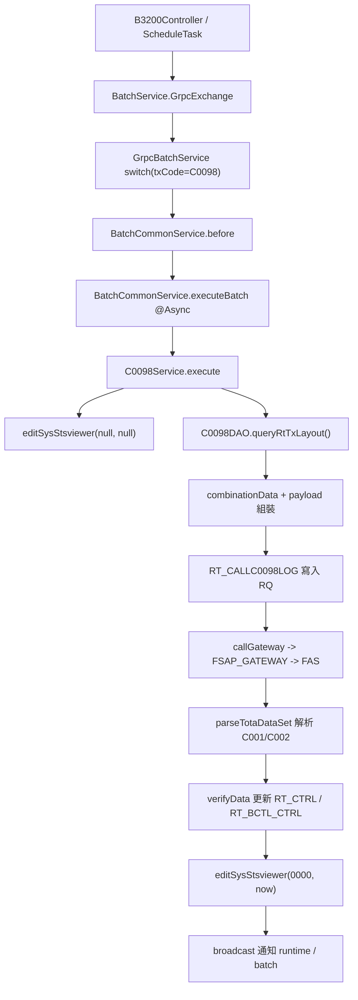

# fsap-adm / C0098Service.java 分析報告

## 1. 任務摘要
- 分析目標：釐清 `C0098Service.java` 在 `fsap-adm` 中的用途、上游入口、下游交易節點、資料契約、異常流與修改風險。
- 分析範圍：`fsap-common-service` 的 `C0098Service`、其 gRPC 分派鏈、`C0098DAO`、相關 repository/entity、`C0098SQL.xml`、手動與排程入口。
- 已確認資訊：`C0098Service` 是一支 Spring Batch Job Bean，負責向 FAS 發送 `C0098` 電文，解析回傳的 `C001` / `C002` 資料，更新 `RT_CTRL`、`RT_BCTL_CTRL`、`SYS_STSVIEWER`，並將 request/response 留痕到 `RT_CALLC0098LOG`。
- 尚未確認資訊：實際排程資料中的 `schedType` 設定、`EnvelopeService` 背後 XML 的具體位移定義、FAS 對非 `0000/9998` 狀態碼的正式契約。

## 2. 目標定位
| 欄位 | 內容 |
|------|------|
| 專案/模組 | `fsap-adm`；目標位於 `fsap-common-service` |
| 檔案路徑 | `fsap-adm/fsap-common-service/src/main/java/com/bot/fsap/service/C0098Service.java` |
| 類型/層級 | `@Service("C0098")` + `@Batch(type = JobPrcsLogType.BATCH)` 的批次服務類 |
| 候選狀態 | 唯一命中 |

## 3. 主要用途與角色
- 主要用途：執行「C0098 服務偵測及同步資料取回」，主動向 FAS 取回共用控制資料並回寫 FSAP 內部控制表。
- 主角色：`External Adapter` + `Data Guardian`。它主動對接 FAS 電文，並對內維護控制表與同步序號。
- 次角色：`Orchestrator`。當同步有異動時，會再對三個 runtime/batch 服務發出 BC 廣播。
- 重要性：高。此服務會直接修改 `RT_CTRL`、`RT_BCTL_CTRL`、`SYS_STSVIEWER`，並通知 `FSAP_RUNTIME`、`FSAP-BATCH-RUNTIME`、`FSAP-BATCH` 重新同步。

## 4. 上游來源與路由鏈
- 上游來源：
  - 手動入口：`B3200Controller.execute()` 直接呼叫 `batchService.GrpcExchange(inputVO, "S")`。
  - 排程入口：`ScheduleTask.executeBatchJob(jobId)` 呼叫 `batchService.GrpcExchange(inputVO, jobSchedule.getSchedType())`。
- 入口總控：
  - `BatchService.GrpcExchange()` 在 `schedType="S"` 時，會將 `jobId` 拆成 `txCode`/`dscpt`，目標服務設為 `FSAP-COMMON-SERVICE`。
  - `GrpcBatchService.rpcPeriphery()` 以 `RqHeader.txCode` 做 switch；`txCode="C0098"` 時會進 `runBatch()`。
  - `runBatch()` 先組 `BatchInput`，執行 `batchCommonService.before()`，成功後再呼叫 `batchCommonService.executeBatch()`。
  - `BatchCommonService.executeBatch()` 被 `@Async("defaultExecutor")` 標記，實際以 `jobs.get(jobId).execute(jobInput)` 非同步執行 bean name 為 `C0098` 的 Job。
- 分流條件：
  - `GrpcBatchService` 必須收到 `txCode="C0098"` 才會命中本類。
  - 排程是否直接命中 `C0098Service`，取決於 `jobSchedule.getSchedType()` 是否為 `"S"`；若為 `"B"`，`BatchService` 會改送 `BT001/SCHED` 到 `FSAP-BATCH`。
- 實際命中：
  - [Confirmed] `@Service("C0098")` 讓 `BatchCommonService` 可用 `jobId=C0098` 命中本 bean。
  - [Confirmed] 上游收到 gRPC `xBotStatus=0000` 只代表「已通過前置檢查並接受啟動」，不代表 `C0098Service.execute()` 已完成，因為真正執行在 `@Async` 中。
  - [Inferred] 若排程資料把此作業設為 `"B"`，則不會直接以 `txCode=C0098` 命中本類；靜態碼無法確認實際排程設定。

## 5. 下游去向與交易節點
- 下游系統/元件：
  - `FSAP_GATEWAY`：`callGateway()` 對 FAS 發出 `C0098` request。
  - `EnvelopeService`：使用 `FAS_2_FSAP_RESPONSES` 解析回應。
  - `ErrHndlService`：統一寫入錯誤處理事件。
  - `FSAP_RUNTIME`、`FSAP-BATCH-RUNTIME`、`FSAP-BATCH`：當同步有異動時發 BC gRPC 廣播。
- DB / SQL / SP：
  - 讀 `RT_TX_LAYOUT` / `CFG_TX_FORMAT`：取得 request 格式。
  - 讀寫 `RT_CTRL`：同步 `TODAYCTL`、`NEXTDYCTL`，並累加 `SYSSYNCNO` / `BRANCHSYNCNO`。
  - 讀寫 `RT_BCTL_CTRL`：同步分行控制資料。
  - 讀寫 `SYS_STSVIEWER`：記錄 FAS 偵測狀態。
  - 寫 `RT_CALLC0098LOG`：保存 RQ / RS 內容。
- 事件 / MQ / callback：未看到 MQ；對外互動以 gRPC 為主。
- 交易觸點：
  1. 先把 `SYS_STSVIEWER(FAS)` 設為待更新。
  2. 組 `C0098` request，寫入 `RT_CALLC0098LOG` RQ。
  3. 呼叫 `FSAP_GATEWAY` 轉送 FAS。
  4. 成功解析後寫入 `RT_CALLC0098LOG` RS。
  5. 視 `C001` / `C002` 差異更新資料表並廣播通知。

## 6. 資料契約與物件結構
- 入口參數 / Request：
  - `execute(BatchInput input)` 幾乎不依賴 `input` 的業務欄位，主體 request 內容由 `RT_TX_LAYOUT` 動態組裝。
- 關鍵 header / payload：
  - request header 固定為 12 bytes `0x0f`。
  - payload 由 `header + BUR 編碼本文 + 0x03` 組成。
  - `callGateway()` 的 gRPC header 會帶 `XBotClientId=FSAP-Common`、`XBotServerId=FAS`、`XBotRtBatchFlag=B`。
  - `RqHeader` 帶 `txCode=C0098`、`rstinq=0`、`hcode=0`、`txcodeFmtid=C0098..I`。
- 中途轉換物件：
  - `C9800RtTxLayoutVO`：承接電文欄位設定與組裝後內容。
  - `C0098TotaDataSetVO`：承接每個 tota 的 `msgid / cfgMtype / cfgMsgno / cfgErrorMsg / totaData`。
  - `C0098VerifyResultVO`：只包含 `CHG_C0098_C001_1`、`CHG_C0098_C002` 兩個異動旗標。
- 回應物件 / 輸出欄位：
  - `parseTotaDataSet()` 依 `IT_TOTW_LABEL`、`IT_TOTW_ERR`、`IT_TOTW_TEXT` 區段切資料。
  - `msgid` 由 `cfgMtype + cfgMsgno` 組成，實作上只對 `C001` / `C002` 做同步處理。
- C0098 request 主要欄位值：
  - `KINBR`：`commonService.findParamNameByTypeAndCode("FSAPINFO", "KINBR", "919")`
  - `TRMSEQ=6200`
  - `TXTNO=commonService.getTxSeq("6200", 8)`
  - `ORGKIN/ORGTRM/ORGTNO`：回填前述交易識別值
  - `TTSKID/TRMTYP`：由 `FSAPINFO` 參數取得
  - `TXCODE=C0098`
  - `DSCPT=S98`
  - `MTTPSEQ=0`
  - `RSTINQ/PTYPE/CRDB/HCODE/TOTAFG/WARNFG/PSEUDO/VER` 等欄位由程式固定指定

## 7. 流程圖

## 8. 正常流
1. 入口：`execute()` 啟動後先把 `SYS_STSVIEWER(FAS)` 更新為待重新偵測狀態。
2. 前置處理：透過 `C0098DAO.queryRtTxLayout()` 找出啟用中的 `C0098` input 格式，並由 `combinationData()` 逐欄組值。
3. 核心邏輯：將電文字串轉為 BUR 編碼，加上 12-byte header 與 ETX 後形成 payload，先寫一筆 `RT_CALLC0098LOG` RQ。
4. 資料查詢/轉換：
   - `callGateway()` 把 request 經 `FSAP_GATEWAY` 送到 FAS。
   - `parseTotaDataSet()` 逐段拆出 tota，產生 `C0098TotaDataSetVO`。
   - `verifyData()` 對 `C001` 比對並更新 `RT_CTRL.todayctl/nextdyctl/syssyncno`。
   - `verifyData()` 對 `C002` 依 occurs 設定拆出各分行欄位，比對並更新 `RT_BCTL_CTRL`，每筆異動都會遞增 `RT_CTRL.branchsyncno`。
5. 回傳/副作用：
   - 以第一筆 tota 寫入 `RT_CALLC0098LOG` RS。
   - 將 `SYS_STSVIEWER(FAS)` 更新為 `status=0000`、`rcvDt=now()`。
   - 若 `C001` / `C002` 任一有異動，發出 BC gRPC 通知周邊服務。
   - gRPC 呼叫端在 `runBatch()` 階段就會拿到 `xBotStatus=0000`，真正完成與否需另外看 BPS、log 與資料表狀態。

## 9. 異常流
- 錯誤觸發點：
  - 查無 `C0098` input 格式：`E00106`
  - 查無 `RT_CTRL`：`E00115`
  - 呼叫 FAS 回 `xBotStatus=9998`：視為 timeout，更新 `SYS_STSVIEWER.status=9998` 後結束
  - tota `mtype` 為 `E` 或 `X`：`E86002`
  - tota 解析失敗：`E86003`
  - `RT_CALLC0098LOG` 寫入失敗：`E86001`
  - `RT_BCTL_CTRL` 查無指定 `BRNO`：`E86005`
  - BC 廣播失敗：`E86007`
  - 其他未帶 `E` 前綴的例外：`E80001`
- 錯誤回應/補償：
  - 透過 `composeErrHndVO()` 組 `ErrHndlVO` 並呼叫 `errHndlService.prcsErrMsg()`。
  - `C002` 單筆分行資料查無 `BRNO` 時，只記錯並繼續處理其餘資料，存在部分成功情境。
  - 啟動端若只看 gRPC `0000`，無法得知非同步執行期間的後續失敗。
- 可能二次失敗點：
  - `EnvelopeService` 找不到 `FAS_2_FSAP_RESPONSES` 對應 header/item 時，會進入 `E86003` 路徑。
  - `broadcast()` 逐個 provider 發 BC；任一 host 回非 `0000` 即被視為該目標同步失敗。
  - DB 已更新但 BC 廣播失敗時，會形成「資料已寫入、下游未同步」的不一致視窗。
- 未驗證異常場景：
  - `xBotStatus` 若為非 `0000` 且非 `9998`，程式仍會直接進 tota 解析流程；靜態碼無法證明這是否符合 FAS 契約。

## 10. 依賴與影響
- 入站依賴：
  - `B3200Controller`
  - `ScheduleTask`
  - `BatchService`
  - `GrpcBatchService`
  - `BatchCommonService`
- 出站依賴：
  - `CommonService`
  - `EnvelopeService`
  - `ErrHndlService`
  - `C0098DAO`
  - `RtCtrlRepo`
  - `RtBctlCtrlRepo`
  - `SysStsviewerRepo`
  - `RtCallc0098Repo`
- Build / Config 關聯：
  - SQL map 在 `fsap-common-service/src/main/resources/sql/C0098SQL.xml`。
  - 回應解析依賴 `EnvelopeService` 中的 `FAS_2_FSAP_RESPONSES`。
  - request 欄位值依賴參數表中的 `FSAPINFO`、`TIMEOUT_INFO`。
- 修改風險與波及範圍：
  - 高風險區域：`verifyData()`、`queryRtTxLayoutByFldRtesname()`、`broadcast()`。
  - 任一欄位位移、occurs 長度、`RT_TX_LAYOUT` 規則若變動，會直接影響 `RT_CTRL/RT_BCTL_CTRL` 的對位更新。
  - `queryRtTxLayoutByFldRtesname()` 的 SQL 條件為 `TX_CODE='C0098' AND ... OR TXF_LINKID=:txfLinkId AND ...`，存在 AND/OR 優先序誤讀風險；若資料設計不嚴謹，可能撈入超出預期的 occurs 主設定。
  - 廣播內容或目標若改動，會影響 runtime / batch 側重新同步機制。
  - 啟動鏈為非同步，若維運把啟動回應誤當作完成訊號，會誤判作業成功。

## 11. 條件附錄（符合 facet 時才補）

### 批次與排程維護
- 啟動方式：
  - 手動：`B3200Controller.execute()` 固定以 `"S"` 模式呼叫 `BatchService.GrpcExchange()`。
  - 排程：`ScheduleTask.executeBatchJob()` 使用 `jobSchedule.getSchedType()`，可能走 `"S"` 或 `"B"`。
- 排程條件或 job mode：
  - `"S"`：送 `txCode=C0098` 到 `FSAP-COMMON-SERVICE`。
  - `"B"`：改送 `BT001/SCHED` 到 `FSAP-BATCH`，不會直接由本類接單。
- 執行前檢查：
  - `BatchCommonService.before()` 會檢查 job 是否存在、是否超過併發上限、並先寫入 BPS 狀態。
- 成功後驗證：
  - 不可只看 gRPC `xBotStatus=0000`。
  - 應同時檢查 `SYS_STSVIEWER(FAS).status/rcvDt`、`RT_CALLC0098LOG` 是否有成對 `RQ/RS`、`RT_CTRL.syssyncno/branchsyncno` 是否變動、以及 BPS/Job log 最終狀態。
- 失敗後排查：
  - 先看 `ErrHndlService` 事件碼：`E00106`、`E00115`、`E86001`、`E86002`、`E86003`、`E86005`、`E86007`、`E80001`。
  - 再看 `SYS_STSVIEWER.status` 是否為 `9998` timeout。
- 可否重跑：
  - [Confirmed] 有手動重跑入口。
  - [Inferred] 可重跑前提是外部 FAS 契約、電文格式、遠端註冊資訊已恢復正常。
- 併發、重入、重複執行風險：
  - [Confirmed] 存在併發上限檢查。
  - [Confirmed] 實際執行是非同步；若前一次尚未完成又再次手動觸發，是否能被擋下取決於 BPS/concurrency 設定，而不是 `C0098Service` 自身。

### 資料寫入矩陣
| 寫入目標 | 寫入方式 | Key / 查找條件 | 寫入欄位 | 觸發條件 | 備註 |
|---------|----------|----------------|----------|----------|------|
| `SYS_STSVIEWER` | `save` | `SYS_ID='FAS'` | `SND_DT`、`RCV_DT`、`STATUS` | 作業開始、timeout、成功 | 開始時會把 `status` 與 `rcvDt` 重設 |
| `RT_CALLC0098LOG` | `saveAndFlush` | OID 自動產生 | `RQ_RS`、`RTN_CODE`、`RTN_MSG`、`API_CONTENT` 等 | 送出前寫 `RQ`、解析後寫 `RS` | `RS` 只取第一筆 tota |
| `RT_CTRL` | `save` | `findFistByOrderByCreateTime()` | `TODAYCTL`、`NEXTDYCTL`、`SYSSYNCNO` | `C001` 與現值不同 | `SYSSYNCNO` 每次異動加 1 |
| `RT_BCTL_CTRL` | `save` | `BRNO` | `SBRNO`、`ACFLG`、`BRCLS`、`DEPTCLS1~10`、`RU1TM`、`TCCLSN` | `C002` 單筆分行資料與現值不同 | 每筆異動後另加 `RT_CTRL.branchsyncno + 1` |
| `RT_CTRL` | `save` | 同上 | `BRANCHSYNCNO` | 任一 `C002` 分行資料異動 | 每筆異動各加 1，不是整批只加 1 |
- 部分成功場景：
  - 某些 `BRNO` 查無資料時只記 `E86005` 並續跑，其他分行仍可成功更新。
  - DB 已更新但 BC 廣播失敗時，資料表狀態可能已是新值。
- 人工修復注意事項：
  - 重跑前要一起檢查 `RT_CTRL`、`RT_BCTL_CTRL`、`SYS_STSVIEWER`、`RT_CALLC0098LOG`，不要只看單表。
  - `branchsyncno` 是每筆分行異動都會累加，人工比對時不能假設「一次作業只加 1」。

### 廣播/事件通知矩陣
| 觸發條件 | 發送目標 | 發送內容 | 下游預期行為 | 失敗影響 |
|---------|----------|----------|--------------|----------|
| `CHG_C0098_C001_1=true` | `FSAP_RUNTIME`、`FSAP-BATCH-RUNTIME`、`FSAP-BATCH` | `txCode=BC`、`dscpt=C001` | [Inferred] 重新載入系統控制相關資料 | 可能資料已更新但下游未刷新 |
| `CHG_C0098_C002=true` | `FSAP_RUNTIME`、`FSAP-BATCH-RUNTIME`、`FSAP-BATCH` | 先送 `dscpt=C002`，再補送 `dscpt=C001` | [Inferred] 先同步分行資料，再同步控制資料 | 同上，且失敗清單會混在同一筆 `E86007` |
- 廣播失敗處理：
  - 任一目標回非 `0000` 或例外都會被收斂成 `E86007`。
  - 服務仍會保留已完成的資料寫入，不會回滾。
- 回歸驗證點：
  - 驗證三個目標服務是否收到 `BC`。
  - 驗證下游是否真的重新讀取最新 `RT_CTRL` / `RT_BCTL_CTRL`。

### 外部契約與成功條件
- request 契約：
  - 對外由 `FSAP_GATEWAY` 發送。
  - `XBotServerId=FAS`、`XBotRtBatchFlag=B`、`txCode=C0098`、`txcodeFmtid=C0098..I`。
  - payload 採 `BUR` 編碼、`Format.TEXT`，外層包 12-byte `0x0f` header 與 `0x03` 結尾。
- response 契約：
  - `PeripheryResponse.apheader.xBotStatus` 提供 gateway 層狀態。
  - payload 以 `FAS_2_FSAP_RESPONSES` 定義解析 `IT_TOTW_LABEL`、`IT_TOTW_ERR`、`IT_TOTW_TEXT`。
  - `msgid = mtype + msgno`，當 `mtype in ('E','X')` 視為失敗。
- 成功條件：
  - [Confirmed] 程式只對 `xBotStatus=9998` 做 timeout 特判。
  - [Confirmed] 只要 tota 可被解析且 `mtype` 非 `E/X`，流程就會繼續驗證資料。
  - [Inferred] 實務上的正常回應多半仍應為 `xBotStatus=0000`，但本類並未明文強制。
- 未知狀態處理：
  - `xBotStatus` 非 `0000/9998` 的處理規則未在本類明確定義。
  - `payloadMap` 若缺少 key `0` 或 tota 結構不完整，會落入解析異常路徑。
- 契約缺口：
  - `EnvelopeService` 對應的 XML 欄位位移未在本次直接展開。
  - FAS 是否保證只回 `C001` / `C002` 未由本類強制驗證。
- 相容性風險：
  - 若主機回應欄位位移或 occurs 長度改變，`verifyData()` 會直接錯位解析。

### 重跑與補救
- 重跑入口：
  - `B3200Controller.execute()`。
- 可重跑前提：
  - `RT_TX_LAYOUT` / `CFG_TX_FORMAT` 設定完整。
  - `FSAP_GATEWAY` 到 FAS 的連線與 provider 註冊正常。
  - 若前次為 timeout 或契約錯誤，需先排除外部原因。
- 不可直接重跑的情境：
  - [Inferred] 若已人工修改 `RT_CTRL` / `RT_BCTL_CTRL` 但未同步其他服務，直接重跑可能覆蓋人工修正。
  - [Inferred] 若下游 runtime 已部分刷新，重跑前需先確認是否接受再次廣播。
- 重跑前要清查的表或狀態：
  - `SYS_STSVIEWER(FAS)`
  - `RT_CALLC0098LOG`
  - `RT_CTRL`
  - `RT_BCTL_CTRL`
  - BPS / Job process log
- 重跑後驗證點：
  - `SYS_STSVIEWER.status` 是否回到 `0000`
  - 是否有新的 `RQ/RS` log
  - `syssyncno/branchsyncno` 是否符合本次異動量
  - 三個 BC 目標是否都同步成功

### 快取/同步刷新驗證
- 刷新對象：
  - `FSAP_RUNTIME`
  - `FSAP-BATCH-RUNTIME`
  - `FSAP-BATCH`
- 觸發條件：
  - `C001` 或 `C002` 任一異動。
- 刷新前後依賴資料：
  - 刷新前依賴 `RT_CTRL`、`RT_BCTL_CTRL` 已先更新。
  - [Inferred] 下游收到 BC 後，應以最新 DB 狀態重建本地快取或記憶體狀態。
- 失敗後影響：
  - DB 與下游快取可能不同步。
  - 若只重送 BC 而未重跑整批，是否安全要看下游是否支援單獨刷新；本類未提供明文說明。
- 驗證方式：
  - 確認三個目標服務回 `0000`。
  - 進一步確認下游是否實際載入新值；這部分在本類中是 `Unknown`，需到 BC 接收端驗證。

## 12. 實作細節（需要時）
- 成員變數：
  - 核心依賴集中在 `ErrHndlService`、`CommonService`、`JobPrcsLogService`、`EnvelopeService`、`C0098DAO` 與四個 repository。
  - `env` 僅用於查 BC provider 時帶入執行環境。
- 方法：
  - `execute()`：主流程總控。
  - `broadcast()` / `sendGrpc()`：將 `C001` / `C002` 異動通知周邊服務。
  - `verifyData()`：比對回應資料並更新 `RT_CTRL` / `RT_BCTL_CTRL`。
  - `parseTotaDataSet()`：依 envelope 設定切 tota。
  - `initRtCallC0098LogByRQ()` / `initRtCallC0098LogByRS()`：保存 request/response。
  - `callGateway()`：發送 `C0098` 到 `FSAP_GATEWAY`。
  - `combinationData()` / `columnFormat()`：依欄位設定組 request。
  - `editSysStsviewer()`：更新 `SYS_STSVIEWER(FAS)`。
  - `composeErrHndVO()`：送出錯誤處理資料。
- 關鍵局部變數：
  - `dataVO`：組裝後 request 欄位內容。
  - `payloadData`：真正送給 FAS 的位元組內容。
  - `totaDataSetVOList`：回應解析結果清單。
  - `CHG_C0098_C001_1` / `CHG_C0098_C002`：決定是否廣播通知。
- 相關資料結構：
  - `RT_CTRL` 關注欄位：`TODAYCTL`、`NEXTDYCTL`、`SYSSYNCNO`、`BRANCHSYNCNO`
  - `RT_BCTL_CTRL` 關注欄位：`BRNO`、`SBRNO`、`ACFLG`、`BRCLS`、`DEPTCLS1~10`、`RU1TM`、`TCCLSN`
  - `SYS_STSVIEWER` 關注欄位：`SYS_ID`、`SND_DT`、`RCV_DT`、`STATUS`
  - `RT_CALLC0098LOG` 關注欄位：`RQ_RS`、`RTN_CODE`、`RTN_MSG`、`API_CONTENT`

## 13. 關鍵證據
- [Confirmed] `C0098Service` 為 `@Service("C0098")`、`@Batch(type = JobPrcsLogType.BATCH)`，且類別註解明示「C0098 服務偵測及同步資料取回」：`fsap-adm/fsap-common-service/src/main/java/com/bot/fsap/service/C0098Service.java:43-58`
- [Confirmed] `execute()` 會先更新 `SYS_STSVIEWER`、讀格式、組 payload、寫 RQ log、call gateway、解析回應、驗證資料、更新成功狀態並廣播：`C0098Service.java:73-162`
- [Confirmed] `broadcast()` 在 `CHG_C0098_C001_1` 時通知 `FSAP_RUNTIME`、`FSAP-BATCH-RUNTIME`、`FSAP-BATCH`；在 `CHG_C0098_C002` 時除了通知 `C002`，還會再補送一次 `C001`：`C0098Service.java:171-240`
- [Confirmed] `verifyData()` 對 `C001` 只比對與更新 `TODAYCTL`、`NEXTDYCTL`，並遞增 `SYSSYNCNO`：`C0098Service.java:328-390`
- [Confirmed] `verifyData()` 對 `C002` 會以 occurs 方式拆 `BRNO/SBRNO/ACFLG/BRCLS/DEPTCLS1~10/RU1TM/TCCLSN`，更新 `RT_BCTL_CTRL` 並遞增 `RT_CTRL.branchsyncno`：`C0098Service.java:461-610`
- [Confirmed] `parseTotaDataSet()` 使用 `FAS_2_FSAP_RESPONSES` 的 `IT_TOTW_LABEL`、`IT_TOTW_ERR`、`IT_TOTW_TEXT`，且 `mtype in ("E","X")` 會轉成 `E86002`：`C0098Service.java:648-730`
- [Confirmed] `initRtCallC0098LogByRQ()` / `initRtCallC0098LogByRS()` 分別寫入 `RT_CALLC0098LOG` 的 `RQ` / `RS` 記錄：`C0098Service.java:736-802`
- [Confirmed] `callGateway()` 以 `DispatcherService.FSAP_GATEWAY` 發送 `txCode=C0098`、`txcodeFmtid=C0098..I` 的 gRPC request：`C0098Service.java:808-836`
- [Confirmed] `combinationData()` 會把 `KINBR/TRMSEQ/TXTNO/ORGKIN/ORGTRM/ORGTNO/TTSKID/TRMTYP/TXCODE/DSCPT/...` 等欄位逐一固定填值或取參數：`C0098Service.java:867-932`
- [Confirmed] `editSysStsviewer()` 以 `SYS_ID="FAS"` 查找並更新 `SYS_STSVIEWER`：`C0098Service.java:980-1002`
- [Confirmed] `C0098DAO.queryRtTxLayout()` 透過 `C0098SQL.xml` 的 `CFG_TX_FORMAT + RT_TX_LAYOUT` 查出啟用中的 input 格式：`fsap-adm/fsap-common-service/src/main/java/com/bot/fsap/dao/C0098DAO.java:46-49`、`fsap-adm/fsap-common-service/src/main/resources/sql/C0098SQL.xml:71-99`
- [Confirmed] `queryRtTxLayoutByFldEsname` 固定查 `C0098.C001.O` 並只取 `OT_C0098_TODAYCTL`、`OT_C0098_NEXTDYCTL`、`OT_C0098_DAYTONIGHT` 三欄：`C0098DAO.java:52-56`、`C0098SQL.xml:52-69`
- [Confirmed] `queryRtTxLayoutByFldRtesname` 以 `FLD_RTESNAME IN (...)` 或 `TXF_LINKID=:txfLinkId 且 FLD_MULTICOLFG='Y' 且 FLD_MULTIFG='Y'` 取回 response 欄位設定，SQL 原文未加括號：`C0098DAO.java:58-63`、`C0098SQL.xml:25-50`
- [Confirmed] gRPC 路由中 `txCode="C0098"` 會進 `runBatch()`；`runBatch()` 成功前會先經 `batchCommonService.before()`：`fsap-adm/fsap-common-service/src/main/java/com/bot/fsap/service/GrpcBatchService.java:95-106,241-256`
- [Confirmed] `BatchCommonService.executeBatch()` 透過 `@Async("defaultExecutor")` 非同步執行 `jobs.get(jobId).execute(jobInput)`：`fsap-adm/fsap-common-service/src/main/java/com/bot/fsap/service/BatchCommonService.java:47-60`
- [Confirmed] 手動入口在 `B3200Controller.execute()`，固定以 `"S"` 模式呼叫 `GrpcExchange()`：`fsap-adm/fsap-admin-api/src/main/java/com/bot/fsap/controller/B3200Controller.java:51-57`
- [Confirmed] 排程入口在 `ScheduleTask.executeBatchJob()`，實際模式取自 `jobSchedule.getSchedType()`：`fsap-adm/fsap-schedule/src/main/java/com/bot/fsap/schedule/service/ScheduleTask.java:69-80`
- [Confirmed] `BatchService.GrpcExchange()` 在 `schedType="S"` 時送往 `FSAP-COMMON-SERVICE`，否則改用 `BT001/SCHED` 送往 `FSAP-BATCH`：`fsap-adm/fsap-admin-service/src/main/java/com/bot/fsap/service/BatchService.java:81-159,162-203`
- [Confirmed] `RT_CTRL` 實體定義包含 `TODAYCTL`、`NEXTDYCTL`、`DAYTONIGHT`、`SYSSYNCNO`、`BRANCHSYNCNO`：`fsap-adm/fsap-admin-model/src/main/java/com/bot/fsap/entity/RtCtrlEntity.java:41-69`
- [Confirmed] `RT_BCTL_CTRL` 實體定義包含 `BRNO`、`SBRNO`、`ACFLG`、`BRCLS`、`DEPTCLS1~10`、`RU1TM`、`TCCLSN`：`fsap-adm/fsap-admin-model/src/main/java/com/bot/fsap/entity/RtBctlCtrlEntity.java:29-76`
- [Confirmed] `SYS_STSVIEWER` 實體定義包含 `SYS_ID`、`SND_DT`、`RCV_DT`、`STATUS`：`fsap-adm/fsap-admin-model/src/main/java/com/bot/fsap/entity/SysStsviewerEntity.java:31-42`
- [Confirmed] `RT_CALLC0098LOG` 實體定義包含 `RQ_RS`、`RTN_CODE`、`RTN_MSG`、`API_CONTENT` 等留痕欄位：`fsap-adm/fsap-admin-model/src/main/java/com/bot/fsap/entity/RtCallc0098logEntity.java:41-87`
- [Inferred] `C0098` 屬於「可手動觸發，也可被排程觸發」的同步作業，但實際 production/sit 環境用哪種模式要看排程資料，程式本身無法確認。
- [Inferred] `broadcast()` 在 `C002` 異動後再補送 `C001`，看起來是在保證分行資料同步後一併刷新系統控制快取，但程式內沒有註解或規格說明此設計原因。
- [Unknown] `EnvelopeService` 對應 XML 中各欄位實際 start/end/length 定義未在本次分析中直接展開。
- [Unknown] FAS 端對 `xBotStatus` 非 `0000/9998` 時應如何處理，僅靠本地程式無法定案。

## 14. 第十人原則審查
- 被挑戰的結論：
  - 不能直接說「gRPC 回 `0000` 就表示 `C0098` 執行成功」；目前 `runBatch()` 只代表已接受啟動，真正執行在 `@Async` 中。
  - 不能直接說「成功條件一定是 `xBotStatus=0000`」；目前程式只對 `9998` 做 timeout 特判，其餘狀態仍會進回應解析流程。
  - 不能直接說「C001 會同步整個 `RT_CTRL`」；目前實際啟用的只有 `TODAYCTL`、`NEXTDYCTL`，`TBSDY`、`NBSDY`、`DAYTONIGHT` 相關邏輯都被註解掉。
  - 不能直接說「SYS_SYSINFO 也會同步」；`C001_2` 整段程式目前是註解狀態，不會執行。
  - 需要警覺 `queryRtTxLayoutByFldRtesname` 的 SQL 條件優先序；目前寫法是否會撈到非預期資料，取決於資料分布與 SQL 實際效果。
- 降級結果：
  - 「`C0098Service` 是 FAS 共用控制資料同步作業」維持高信心。
  - 「gRPC 啟動成功等於批次完成」降級為 `Unknown`，實際上應視為不成立。
  - 「`xBotStatus=0000` 才代表可解析成功」降級為 `Unknown`。
  - 「`C002` 後補送 `C001` 是明確業務需求」降級為 `Inferred`。
  - 「`queryRtTxLayoutByFldRtesname` 必然撈錯資料」不能直接成立，只能列為 SQL 風險點。
- 仍保留的高信心結論：
  - `C0098Service` 會主動呼叫 FAS。
  - 它確實會同步 `RT_CTRL` / `RT_BCTL_CTRL` 並留痕到 `SYS_STSVIEWER` / `RT_CALLC0098LOG`。
  - 異動後確實會對 runtime / batch 類服務送出廣播通知。
