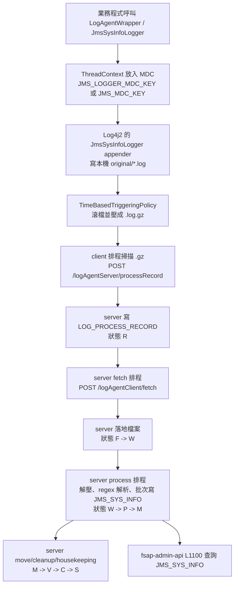

# fsap-ai / log 集中化如何運作 分析報告

## 1. 任務摘要
- 分析目標：說明此 workspace 內「log 集中化」的主鏈路、上下游、資料契約、異常流，以及 `logback / appender / fluentd / ELK / tracing` 在其中的實際角色。
- 分析範圍：`fsap-runtime/modules/log-agent`、`fsap-runtime/boot/runtime`、`fsap-adm/log-agent`、`fsap-adm/fsap-admin-api`、`fsap-gateway`、`ncl/fac/ncl-batch` 的 logging 設定與相關程式。
- 已確認資訊：主鏈路是 `Log4j2 appender -> 本機滾檔(.log/.gz) -> log-agent client 上報 -> log-agent server 回抓與解析 -> DB(JMS_SYS_INFO) -> 後台查詢`。
- 尚未確認資訊：各子專案實際部署時是否全部都啟用這條集中化鏈；但 repo 內已能確認 `fsap-runtime`、`fsap-adm`、`fsap-gateway` 都有對應接點。

## 2. 目標定位
| 欄位 | 內容 |
|------|------|
| 專案/模組 | `fsap-runtime/modules/log-agent`、`fsap-adm/log-agent`、`fsap-adm/fsap-admin-api`、`fsap-gateway` |
| 檔案路徑 | `fsap-runtime/modules/log-agent/...`、`fsap-runtime/boot/runtime/src/main/resources/log4j2.yml`、`fsap-adm/log-agent/...`、`fsap-adm/fsap-admin-api/src/main/resources/log4j2.yml` |
| 類型/層級 | `feature` / 跨模組基礎設施流程 |
| 候選狀態 | `Confirmed` |

## 3. 主要用途與角色
- 主要用途：把各節點應用程式產生的交易型結構化 log 收斂成可集中查詢的 `JMS_SYS_INFO` 資料。
- 主角色：
  - `JmsSysInfoLogger` appender：把結構化欄位寫入本機特定檔案路徑。
  - `fsap-log-agent-client`：掃描已滾動壓縮的 `.gz` 檔、向 server 上報待處理清單、提供 fetch/cleanup API。
  - `fsap-log-agent-server`：收清單、建 `LOG_PROCESS_RECORD`、回抓檔案、解壓逐行解析、批次寫 `JMS_SYS_INFO`。
  - `fsap-admin-api / L1100`：集中查詢出口，直接查 `JMS_SYS_INFO`。
- 次角色：
  - `fsap-runtime/modules/log-agent`：新版 runtime 包裝層，將 `LogInfoVO` 轉為 `JmsSysInfoVO` 後寫入 `JmsSysInfoLogger`。
  - `LogAgentUtils` / 原生 `JmsSysInfoLogger`：較舊接法，直接在 `fsap-adm`、`fsap-gateway` 等模組寫集中化 log。
  - Undertow access log / B3 trace header：屬於 HTTP access tracing，可輔助關聯，不是集中化主輸送通道。
- 重要性：高。`MDC key`、`appender pattern`、檔名規則、排程、Eureka 註冊名、DB schema 任一處改動，都可能讓集中化斷鏈。

## 4. 上游來源與路由鏈
- 上游來源：
  - `fsap-runtime/modules/log-agent/build.gradle:4` 直接依賴 `com.bot:fsap-log-agent-client`。
  - `fsap-runtime/modules/log-agent/src/main/java/com/bot/fsap/modules/log/agent/LogAgentWrapper.java:19-71` 將業務欄位映射到 `JmsSysInfoVO`。
  - `fsap-runtime/modules/log-agent/src/main/java/com/bot/fsap/modules/log/agent/EnhancedJmsSysInfoLogger.java:24-76` 透過 `LogManager.getLogger("JmsSysInfoLogger")` 寫集中化 log。
  - `fsap-gateway/boot/fastgateway` 多個 route builder 直接呼叫 `JmsSysInfoLogger.info(...)`，例如 `CommonRouteBuilder.java`、`RestServerRouteBuilder.java`、`GrpcServerRouteBuilder.java`。
- 入口總控：
  - runtime 新接法：`LogAgentWrapper -> EnhancedJmsSysInfoLogger -> Log4j2 JmsSysInfoLogger appender`
  - 舊接法：`JmsSysInfoLogger / LogAgentUtils -> LoggerHelperImpl -> Log4j2 JmsSysInfoLogger appender`
  - client 排程入口：`fsap-adm/log-agent/fsap-log-agent-client/.../ProcessRecordService.java:53-123`
  - server 接收入口：`fsap-adm/log-agent/fsap-log-agent-server/.../LogAgentServerController.java:36-40`
- 分流條件：
  - client 先透過 `dispatcherService.getNextProviderInfo("FSAP-LOG-SERVER")` 找 server；找不到就不送。證據：`ProcessRecordService.java:58-60,118-120`
  - client 只處理自己 application 名稱對應的 `.gz`。證據：`ProcessRecordService.java:85-98`
  - server 只抓指派給本機 `targetIp/targetPort` 的 `LOG_PROCESS_RECORD`。證據：`FetchService.java:142-159`、`LogServerSQL.xml:79-163`

## 5. 下游去向與交易節點
- 下游系統/元件：
  - `FSAP-LOG-SERVER`：集中化收檔/解析服務
  - `JMS_SYS_INFO`：集中查詢主表
  - `LOG_PROCESS_RECORD`：狀態追蹤表
- DB / SQL / SP：
  - `JMS_SYS_INFO` insert：`fsap-adm/log-agent/fsap-log-agent-server/src/main/resources/sql/LogServerSQL.xml:8-78`
  - `LOG_PROCESS_RECORD` 查詢/更新/插入：`LogServerSQL.xml:79-196,216-270`
  - 後台查詢 `L1100`：`fsap-adm/fsap-admin-api/src/main/resources/sql/L1100SQL.xml:25-140`
- 事件 / MQ / callback：
  - 沒有看到 Kafka / Fluentd / MQ 作為集中化主通道。
  - server 透過 HTTP callback 反向呼叫 client：
    - `POST /logAgentClient/fetch`
    - `POST /logAgentClient/cleanup`
    - 證據：`LogAgentClientController.java:24-35`
- 交易觸點：
  - client 上報清單：`POST /logAgentServer/processRecord`
  - server 回抓檔案：`POST /logAgentClient/fetch`
  - server 清來源備份：`POST /logAgentClient/cleanup`

## 6. 資料契約與物件結構
- 入口參數 / Request：
  - client 上報的是 `LogBasic<List<ProcessRecordVO>>`。證據：`LogAgentServerController.java:36-40`
  - server 回抓/清理 client 用的是 `LogInputVO`。證據：`LogAgentClientController.java:24-35`
- 關鍵 header / payload：
  - `ProcessRecordVO` 至少帶 `ip`、`port`、`applicationName`、`originalPath`、`backupPath`。證據：`ProcessRecordService.java:144-155`
  - `LogInputVO` 帶 `providerLocation` 與 `logFiles(oid, logPath)`。證據：`FetchService.java:176-205`
- 中途轉換物件：
  - runtime 包裝層將 `traceId`、`kinBr`、`trmSeq`、`txtNo`、`x_bot_client_id`、`service_id`、`rq_rs`、`contentMsg`、`content_format`、`content_encoding`、`rtn_code`、`rtn_msg` 等欄位寫入 `JmsSysInfoVO`。證據：`LogAgentWrapper.java:49-109`
  - `EnhancedJmsSysInfoLogger` 將 `JmsSysInfoVO` 轉成 map 字串放進 `ThreadContext` 的 `JMS_LOGGER_MDC_KEY`。證據：`EnhancedJmsSysInfoLogger.java:24-76`
  - 舊版 helper 將 VO 的 `toMap()` 結果放進 `JMS_MDC_KEY`。證據：`LoggerHelperImpl.java:23-61`
- 回應物件 / 輸出欄位：
  - server 用 regex 拆單行 log，再映射進 `JmsSysInfoVO`，最後批次 insert `JMS_SYS_INFO`。證據：`ProcessService.java:81-97,303-475`、`LogServerSQL.xml:11-75`
  - `JMS_SYS_INFO` 主欄位包含 `TRACEID`、`KINBR`、`TRMSEQ`、`TXTNO`、`SYS_LOG_LEVEL`、`BIZ_LOG_LEVEL`、`SERVICE_ID`、`CONTENTMSG`、`CONTENT_FORMAT`、`CONTENT_ENCODING`、`RTN_CODE`、`RTN_MSG`、`THREAD_ID`、`MESSAGE` 等。證據：`LogServerSQL.xml:12-75`

## 7. 流程圖

## 8. 正常流
1. 入口：應用程式建立 `JmsSysInfoVO` 或 `LogInfoVO`，寫入 `traceId`、服務代碼、請求/回應別、內容格式等欄位。
2. 前置處理：VO 被轉成 MDC 字串放到 `ThreadContext`。
3. 本機寫檔：`log4j2.yml` 的 `JmsSysInfoLogger` appender 寫入 `${JMS_SYS_INFO_ORIGINAL_PATH}` 下的特定檔案。
4. 滾檔壓縮：`TimeBasedTriggeringPolicy` 依分鐘或小時滾動，產生 `.log.gz`。
5. client 掃描與上報：client 排程掃描 `.gz`，把清單送到 server；server 回應成功後 client 把來源檔從 original 搬到 backup。證據：`ProcessRecordService.java:79-142`
6. server 建立處理紀錄：`RecordService` 寫入 `LOG_PROCESS_RECORD`，後續由 server 各排程接手。
7. server 回抓檔案：`FetchService` 依 `sourceIp/sourcePort/applicationName` 分組，反向呼叫來源節點的 `/logAgentClient/fetch` 取得檔案內容，落地到 server original 路徑。證據：`FetchService.java:97-158,172-358`
8. server 解析入庫：`ProcessService` 解壓 `.gz`，逐行套 `LOG_PATTERN`，抽出時間、thread、level、extraInfo、message，批次寫入 `JMS_SYS_INFO`。證據：`ProcessService.java:176-294,416-475`
9. 後處理：`MoveService` 搬到 server backup，`CleanupService` 回呼 client 清 backup，`HousekeepingService` 刪除保留期外資料。
10. 查詢：`L1100` 以 `TRACEID` 為主要索引條件，回查交易集中化 log。證據：`L1100SQL.xml:25-140`

## 9. 異常流
- 找不到 `FSAP-LOG-SERVER`：
  - client 只記 warning，不會上報。證據：`ProcessRecordService.java:58-60,118-120`
- `JMS_SYS_INFO_ORIGINAL_PATH` 不存在：
  - client 直接跳過本輪。證據：`ProcessRecordService.java:63-77`
- 來源節點未註冊 Eureka：
  - server 取得不到 `providerLocation`，直接把該批狀態改為 `E`。證據：`FetchService.java:104-114,207-212`
- fetch 連線失敗或 client 回傳失敗：
  - 該批紀錄改 `E`。證據：`FetchService.java:220-250,263-277,307-329,360-366`
- 單行 log 格式不符 regex：
  - 該行跳過，不影響整個檔案其餘行。證據：`ProcessService.java:233-257,418-455`
- 欄位必填檢核失敗：
  - 該行不入庫，只寫 warning。證據：`ProcessService.java:319-347,357-405`
- trigger log：
  - `traceId=TRIGGER` 只用來觸發滾檔，不寫進 `JMS_SYS_INFO`。證據：`LogTriggerSchedule.java:16-23`、`ProcessService.java:425-430`

## 10. 依賴與影響
- 入站依賴：
  - `DispatcherService/Eureka`：client 找 server、server 找 client 都依賴它。證據：`ProcessRecordService.java:58-60`、`FetchService.java:207-212`
  - `MDC key` 與 `appender pattern`：
    - runtime 使用 `JMS_LOGGER_MDC_KEY`。證據：`EnhancedJmsSysInfoLogger.java:24`、`fsap-runtime/boot/runtime/src/main/resources/log4j2.yml:73-80`
    - fsap-adm / gateway / ncl / fac / ncl-batch 多使用 `JMS_MDC_KEY`。證據：`LoggerHelperImpl.java:25`、`fsap-adm/fsap-admin-api/src/main/resources/log4j2.yml:48-55`、`fsap-gateway/config/boot-config/src/main/resources/log4j2.yml:89-96`
  - `appender pattern` 與 server regex 強耦合：
    - pattern：`%d - [%thread] - %-5level - %X{...} - %msg`
    - regex：`ProcessService.LOG_PATTERN`
- 出站依賴：
  - DB：`JMS_SYS_INFO`、`LOG_PROCESS_RECORD`
  - HTTP：`/logAgentServer/processRecord`、`/logAgentClient/fetch`、`/logAgentClient/cleanup`
- Build / Config 關聯：
  - runtime 直接吃 `fsap-log-agent-client`。證據：`fsap-runtime/modules/log-agent/build.gradle:4`
  - client/server 預設 60 秒輪詢。證據：
    - client：`fsap-adm/fsap-admin-api/src/main/resources/config/prod/application.properties:70-72`
    - server：`fsap-adm/log-agent/fsap-log-agent-server/src/main/resources/config/prod/application.properties:33-39`
- 修改風險與波及範圍：
  - 改 `JmsSysInfoLogger` pattern、`MDC key`、檔名規則、路徑規則、`FSAP-LOG-SERVER` 註冊名、`LOG_PROCESS_RECORD` 狀態機，都會影響集中化。
  - 這套是最終一致，不是即時串流；因為至少含滾檔與多段排程，所以天然有分鐘級延遲。

## 11. 條件附錄
- `db_write`
  - 主表：`JMS_SYS_INFO`
  - 狀態表：`LOG_PROCESS_RECORD`
- `external_contract`
  - server 依賴 client API：`/logAgentClient/fetch`、`/logAgentClient/cleanup`
  - client 依賴 server API：`/logAgentServer/processRecord`
- `cache_sync`
  - server 有 `reload` 排程重新載入設定。證據：`ScheduleService.java:126-143`

## 12. 實作細節（需要時）
- appender 與框架現況：
  - 主集中化框架是 `Log4j2`，不是 `logback`。
  - `ncl` 雖保留 `logback.xml` 的 `SiftingAppender + AsyncAppender`，但 `application-dev.yml` 明確指定 `logging.config: classpath:log4j2-spring.yml`。證據：`ncl/src/main/resources/logback.xml:6-55`、`ncl/src/main/resources/application-dev.yml:51-52`
  - `logback.xml` 在這個 workspace 內主要像是舊模組/輔助用途殘留，不是集中化主通道的核心設定。
- tracing 現況：
  - HTTP access log 會把 `X-B3-TraceId`、`X-B3-SpanId` 打到 Undertow access log。證據：`fsap-adm/fsap-monitor/fsap-service-monitor/src/main/resources/application-undertow.yml:63-85`
  - `fsap-gateway` 有 `camel-opentelemetry-starter` 依賴。證據：`fsap-gateway/boot/fastgateway/build.gradle:53`
  - 但目前未看到 `opentelemetry` 直接接進 log 集中化搬運/入庫鏈路。
- ELK / fluentd 現況：
  - 沒有找到 `fluentd`、`fluent-bit`、`logstash`、`kibana` 的實際接線。
  - `fsap-gateway/version.gradle` 只留下註解掉的 `log4j2-elasticsearch-core` 版本提示，未形成有效依賴。證據：`fsap-gateway/version.gradle:71-78`
  - `bpmn-utils/version.gradle` 雖宣告 `log4j2ElasticsearchVersion`，但本次檢索未發現對應 appender 或實際使用點。證據：`bpmn-utils/version.gradle:51-58`

## 13. 關鍵證據
- [Confirmed] runtime 模組接上 log-agent client：`/Users/sonic711/BT/fsap/fsap-ai/fsap-runtime/modules/log-agent/build.gradle:4`
- [Confirmed] runtime wrapper 將交易欄位映射進 `JmsSysInfoVO`：`/Users/sonic711/BT/fsap/fsap-ai/fsap-runtime/modules/log-agent/src/main/java/com/bot/fsap/modules/log/agent/LogAgentWrapper.java:49`
- [Confirmed] runtime 透過 `JMS_LOGGER_MDC_KEY` 寫入 `JmsSysInfoLogger`：`/Users/sonic711/BT/fsap/fsap-ai/fsap-runtime/modules/log-agent/src/main/java/com/bot/fsap/modules/log/agent/EnhancedJmsSysInfoLogger.java:24`
- [Confirmed] runtime `log4j2.yml` 的 `JmsSysInfoLogger` appender 寫入 `${JMS_SYS_INFO_ORIGINAL_PATH}` 並依分鐘滾檔：`/Users/sonic711/BT/fsap/fsap-ai/fsap-runtime/boot/runtime/src/main/resources/log4j2.yml:73`
- [Confirmed] fsap-adm 舊接法使用 `JMS_MDC_KEY`：`/Users/sonic711/BT/fsap/fsap-ai/fsap-adm/log-agent/fsap-log-agent-client/src/main/java/com/bot/fsap/logging/logger/helper/impl/LoggerHelperImpl.java:25`
- [Confirmed] fsap-adm `log4j2.yml` 的 `JmsSysInfoLogger` appender pattern 讀 `JMS_MDC_KEY`：`/Users/sonic711/BT/fsap/fsap-ai/fsap-adm/fsap-admin-api/src/main/resources/log4j2.yml:48`
- [Confirmed] client 每 60 秒掃描/上報：`/Users/sonic711/BT/fsap/fsap-ai/fsap-adm/fsap-admin-api/src/main/resources/config/prod/application.properties:70`
- [Confirmed] server fetch/process/move/cleanup/housekeeping 排程：`/Users/sonic711/BT/fsap/fsap-ai/fsap-adm/log-agent/fsap-log-agent-server/src/main/resources/config/prod/application.properties:33`
- [Confirmed] server 接收清單入口：`/Users/sonic711/BT/fsap/fsap-ai/fsap-adm/log-agent/fsap-log-agent-server/src/main/java/com/bot/fsap/logging/controller/LogAgentServerController.java:36`
- [Confirmed] server 回抓 client fetch/cleanup 入口：`/Users/sonic711/BT/fsap/fsap-ai/fsap-adm/log-agent/fsap-log-agent-client/src/main/java/com/bot/fsap/logging/controller/LogAgentClientController.java:24`
- [Confirmed] server 解析 regex 與 `traceId=TRIGGER` 跳過規則：`/Users/sonic711/BT/fsap/fsap-ai/fsap-adm/log-agent/fsap-log-agent-server/src/main/java/com/bot/fsap/logging/service/ProcessService.java:81`、`:425`
- [Confirmed] server 最終批次寫 `JMS_SYS_INFO`：`/Users/sonic711/BT/fsap/fsap-ai/fsap-adm/log-agent/fsap-log-agent-server/src/main/resources/sql/LogServerSQL.xml:11`
- [Confirmed] 後台查詢直接查 `JMS_SYS_INFO`：`/Users/sonic711/BT/fsap/fsap-ai/fsap-adm/fsap-admin-api/src/main/resources/sql/L1100SQL.xml:25`
- [Confirmed] `ncl` 實際指定 `log4j2-spring.yml`，不是以 `logback.xml` 作集中化主設定：`/Users/sonic711/BT/fsap/fsap-ai/ncl/src/main/resources/application-dev.yml:51`
- [Confirmed] Undertow access log 會記錄 B3 trace header：`/Users/sonic711/BT/fsap/fsap-ai/fsap-adm/fsap-monitor/fsap-service-monitor/src/main/resources/application-undertow.yml:70`
- [Confirmed] `fsap-gateway` 有 `camel-opentelemetry-starter` 依賴，但非 log-agent 主鏈路的一部分：`/Users/sonic711/BT/fsap/fsap-ai/fsap-gateway/boot/fastgateway/build.gradle:53`
- [Inferred] repo 內同時存在 `JMS_MDC_KEY` 與 `JMS_LOGGER_MDC_KEY`，代表新舊接入層並存；只要各自使用對應 `log4j2` 設定就能自洽，不代表兩者會混用同一份 appender。
- [Inferred] `logback.xml` 仍留在部分模組，多半是歷史相容或局部用途，不是目前集中化主通道。
- [Unknown] 各服務在真實部署環境是否全數已切到 runtime 新包裝層，仍需結合最終 deploy artifact 與啟動參數確認。

## 14. 第十人原則審查
- 被挑戰的結論 1：這套是否其實是 `fluentd -> ELK` 的集中化？
  - 降級結果：否。repo 中未看到 `fluentd/logstash/kibana` 實作接點；主要證據都落在本機檔案、HTTP callback、`LOG_PROCESS_RECORD`、`JMS_SYS_INFO`。
- 被挑戰的結論 2：`opentelemetry / B3 traceId` 是否就是集中化主索引？
  - 降級結果：部分否。`traceId` 確實是 `JMS_SYS_INFO` 關鍵欄位之一，但 access log 的 `X-B3-TraceId` 與 Camel OpenTelemetry 只構成可觀測性旁路，不等於 log-agent 主輸送通道。
- 被挑戰的結論 3：`logback` 是否仍是主框架？
  - 降級結果：否。主集中化設定以 `log4j2.yml / log4j2-spring.yml` 為主；`logback.xml` 只在部分模組殘留。
- 仍保留的高信心結論：
  - 集中化主鏈路是 `Log4j2 appender -> 滾檔 -> client/server 排程搬運 -> DB`。
  - `Eureka/DispatcherService` 是關鍵路由依賴。
  - `JMS_SYS_INFO` 是最終集中查詢主表。
  - `appender pattern`、`MDC key`、`ProcessService.LOG_PATTERN` 三者高度耦合，修改風險最高。
