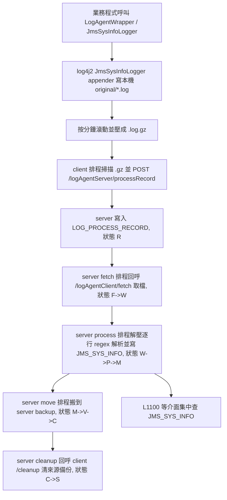

# fsap-ai / log 集中化如何運作 分析報告

## 1. 任務摘要
- 分析目標：說明此 workspace 內「log 集中化」的實際運作方式、上下游、資料契約、排程與風險。
- 分析範圍：`fsap-adm/log-agent`、`fsap-runtime/modules/log-agent`、相關 `log4j2.yml`、`L1100SQL.xml`。
- 已確認資訊：集中化核心是 `fsap-log-agent-client` + `FSAP-LOG-SERVER` 的兩段式檔案管線，不是應用直接把 log 推進 ELK 或 DB。
- 尚未確認資訊：是否所有子專案都已全面切到 `fsap-runtime/modules/log-agent` 包裝層；但 `fsap-adm` 與 `fsap-runtime` 兩條寫入邊界都已可見。

## 2. 目標定位
| 欄位 | 內容 |
|------|------|
| 專案/模組 | `fsap-adm/log-agent`、`fsap-runtime/modules/log-agent`、`fsap-adm/fsap-admin-api` |
| 檔案路徑 | `fsap-adm/log-agent/fsap-log-agent-client/...`、`fsap-adm/log-agent/fsap-log-agent-server/...`、`fsap-runtime/modules/log-agent/...` |
| 類型/層級 | `feature` / 跨模組基礎設施流程 |
| 候選狀態 | `Confirmed` |

## 3. 主要用途與角色
- 主要用途：把各節點本機產生的結構化交易 log 收斂成可集中查詢的 `JMS_SYS_INFO` 資料。
- 主角色：
  - `fsap-log-agent-client`：掃描本機壓縮 log、向 server 回報清單、提供 fetch/cleanup API。
  - `fsap-log-agent-server`：收清單、抓檔、落地、解壓、解析、寫 DB、搬檔、清理。
  - `fsap-runtime/modules/log-agent`：給 runtime 專案使用的寫 log 包裝層。
- 次角色：
  - `log4j2.yml`：決定 `JmsSysInfoLogger` 寫檔格式與滾檔規則。
  - `L1100SQL.xml`：集中化查詢出口，直接查 `JMS_SYS_INFO`。
- 重要性：高。格式、路徑、Eureka 註冊、排程與 DB schema 只要任一邊變動，就可能讓集中化斷鏈。

## 4. 上游來源與路由鏈
- 上游來源：
  - `fsap-runtime/modules/log-agent/build.gradle:1-8` 直接依賴 `com.bot:fsap-log-agent-client`。
  - `fsap-runtime/modules/log-agent/src/main/java/com/bot/fsap/modules/log/agent/LogAgentWrapper.java:19-71` 將業務資料轉成 `JmsSysInfoVO`。
  - `fsap-runtime/modules/log-agent/src/main/java/com/bot/fsap/modules/log/agent/EnhancedJmsSysInfoLogger.java:24-76` 透過 `LogManager.getLogger("JmsSysInfoLogger")` 寫 log。
- 入口總控：
  - `fsap-adm/log-agent/fsap-log-agent-client/src/main/java/com/bot/fsap/logging/service/ProcessRecordService.java:53-123`
  - `fsap-adm/log-agent/fsap-log-agent-server/src/main/java/com/bot/fsap/logging/controller/LogAgentServerController.java:36-40`
- 分流條件：
  - client 先用 `dispatcherService.getNextProviderInfo("FSAP-LOG-SERVER")` 找 server；找不到就不送。證據：`ProcessRecordService.java:58-60,118-120`
  - client 只掃自己 application 名稱對應的 `.gz`。證據：`ProcessRecordService.java:82-98`
  - server fetch/process/move/cleanup/housekeeping 都靠排程與狀態碼驅動。證據：`ScheduleService.java:39-142`
- 實際命中：
  - `fsap-adm/fsap-admin-api/src/main/resources/config/prod/application.properties:70-72` 啟用 client 排程，60 秒一輪。
  - `fsap-adm/log-agent/fsap-log-agent-server/src/main/resources/config/prod/application.properties:33-39` 啟用 server 多段排程。

## 5. 下游去向與交易節點
- 下游系統/元件：
  - `FSAP-LOG-SERVER` 收檔服務
  - `JMS_SYS_INFO` 集中查詢主表
  - `LOG_PROCESS_RECORD` 狀態追蹤表
- DB / SQL / SP：
  - `JMS_SYS_INFO` insert：`fsap-adm/log-agent/fsap-log-agent-server/src/main/resources/sql/LogServerSQL.xml:8-76`
  - `LOG_PROCESS_RECORD` insert/update/select：`LogServerSQL.xml:79-195,236-269`
  - housekeeping delete：`LogServerSQL.xml:197-214`
- 事件 / MQ / callback：
  - 非 MQ/Event Bus。
  - server 透過 HTTP callback 回呼 client `/logAgentClient/fetch` 與 `/logAgentClient/cleanup`。證據：`LogAgentClientController.java:24-35`
- 交易觸點：
  - client POST `/logAgentServer/processRecord`
  - server POST `/logAgentClient/fetch`
  - server POST `/logAgentClient/cleanup`

## 6. 資料契約與物件結構
- 入口參數 / Request：
  - client 上報的是 `LogBasic<List<ProcessRecordVO>>`。證據：`LogAgentServerController.java:36-40`
  - server 回抓與清檔傳的是 `LogInputVO`。證據：`LogAgentClientController.java:24-35`
- 關鍵 header / payload：
  - `ProcessRecordVO` 至少帶 `ip`、`port`、`applicationName`、`originalPath`、`backupPath`。證據：`ProcessRecordService.java:144-155`
- 中途轉換物件：
  - `LogAgentWrapper` 將業務欄位轉成 `JmsSysInfoVO`，含 `traceId`、`service_id`、`rq_rs`、`content_format`、`content_encoding`、`rtn_code` 等欄位。證據：`LogAgentWrapper.java:49-109`
  - `EnhancedJmsSysInfoLogger` 或 `LoggerHelperImpl` 將 VO 塞入 MDC，再交給 `JmsSysInfoLogger` appender。證據：
    - runtime：`EnhancedJmsSysInfoLogger.java:63-76`
    - fsap-adm client：`LoggerHelperImpl.java:23-61`
- 回應物件 / 輸出欄位：
  - server process 後將單行 log 解析成 `JmsSysInfoVO` 再批次寫入 `JMS_SYS_INFO`。證據：`ProcessService.java:222-327`
  - 查詢端 `L1100` 直接從 `JMS_SYS_INFO` 取 list/detail。證據：`fsap-adm/fsap-admin-api/src/main/resources/sql/L1100SQL.xml:25-116`

## 7. 流程圖

## 8. 正常流
1. 入口：應用端用 `LogAgentWrapper` 或 `JmsSysInfoLogger` 類別寫結構化 log。證據：`LogAgentWrapper.java:19-47`、`JmsSysInfoLogger.java:23-95`
2. 前置處理：VO 被轉成 MDC 字串，放進 `ThreadContext`。證據：`EnhancedJmsSysInfoLogger.java:65-76`、`LoggerHelperImpl.java:28-60`
3. 核心寫檔：`log4j2.yml` 的 `JmsSysInfoLogger` appender 把資料寫到 `${JMS_SYS_INFO_ORIGINAL_PATH}/...`，並依時間滾成 `.log.gz`。證據：
   - `fsap-adm/fsap-admin-api/src/main/resources/log4j2.yml:48-60`
   - `fsap-runtime/boot/runtime/src/main/resources/log4j2.yml:73-99`
4. client 上報：`ProcessRecordService` 掃描 `.gz`，把檔案清單送給 `FSAP-LOG-SERVER`，成功後才搬到 client backup。證據：`ProcessRecordService.java:79-113,127-142`
5. server 收件：`RecordService` 建立 `LOG_PROCESS_RECORD`，狀態設 `R`。證據：`RecordService.java:45-75,86-105`
6. server 回抓：`FetchService` 取自身節點責任範圍內 `R` 紀錄，先改成 `F`，再用 Eureka 找來源 app 實例並呼叫 `/logAgentClient/fetch`。證據：`FetchService.java:137-158,172-245`
7. server 落地：抓到檔案後寫到 server 本機 original 路徑，並把狀態改為 `W`。證據：`FetchService.java:298-358`
8. server 入庫：`ProcessService` 取 `W` 紀錄改成 `P`，解壓 `.gz`、用 regex 解析每行、批次 insert `JMS_SYS_INFO`，成功後改為 `M`。證據：`ProcessService.java:99-118,176-267,416-455`
9. server 搬檔：`MoveService` 將 server original 搬到 server backup，狀態 `M -> V -> C`。證據：`MoveService.java:39-100`
10. 清理與保留：`CleanupService` 回呼 client 清 backup 並把狀態改 `S`；`HousekeepingService` 定期刪 DB 舊資料。證據：`CleanupService.java:57-156`、`HousekeepingService.java:35-123`

## 9. 異常流
- 找不到 `FSAP-LOG-SERVER`：
  - client 只記 warning，不會送清單。證據：`ProcessRecordService.java:58-60,118-120`
- original 路徑不存在：
  - client 直接跳過。證據：`ProcessRecordService.java:74-77`
- server 找不到來源 app 的 Eureka provider：
  - 該組紀錄直接改 `E`。證據：`FetchService.java:104-114,207-212`
- client fetch API 回應失敗或沒有檔案：
  - server 將該批紀錄改 `E`。證據：`FetchService.java:263-277,307-329,360-366`
- 單行 log 格式不符 regex、欄位缺值、反射組 VO 失敗：
  - 只跳過該行，不阻斷整個檔案其餘行。證據：`ProcessService.java:241-256,303-327,357-400,416-455`
- trigger log：
  - `traceId=TRIGGER` 只用來觸發滾檔，不寫入 `JMS_SYS_INFO`。證據：`ProcessService.java:425-430`

## 10. 依賴與影響
- 入站依賴：
  - `DispatcherService` / Eureka：client 找 server、server 找來源節點都靠它。證據：`ProcessRecordService.java:58-60`、`FetchService.java:207-212`
  - Log4j2 appender pattern：server regex 解析格式與 appender pattern 強耦合。證據：
    - pattern：`fsap-adm/fsap-admin-api/src/main/resources/log4j2.yml:48-60`
    - regex：`ProcessService.java:81-97`
- 出站依賴：
  - Oracle 表 `JMS_SYS_INFO`、`LOG_PROCESS_RECORD`
  - HTTP 回呼 `/logAgentClient/fetch`、`/logAgentClient/cleanup`
- Build / Config 關聯：
  - runtime 模組直接吃 `fsap-log-agent-client` library。證據：`fsap-runtime/modules/log-agent/build.gradle:1-8`
  - client/server 預設排程值寫在 `application.properties`。證據：
    - client：`fsap-adm/fsap-admin-api/src/main/resources/config/prod/application.properties:70-72`
    - server：`fsap-adm/log-agent/fsap-log-agent-server/src/main/resources/config/prod/application.properties:33-39`
- 修改風險與波及範圍：
  - 改 appender pattern、MDC key、檔名格式、目錄規則、排程時間、Eureka 註冊名，都可能讓 parse/fetch 失效。
  - 這套是最終一致，不是即時串流；60 秒輪詢加多段排程會自然帶入延遲。

## 11. 條件附錄
- `db_write`
  - 寫入主表：`JMS_SYS_INFO`
  - 狀態表：`LOG_PROCESS_RECORD`
- `external_contract`
  - server 依賴 client API：
    - `POST /logAgentClient/fetch`
    - `POST /logAgentClient/cleanup`
  - client 依賴 server API：
    - `POST /logAgentServer/processRecord`
- `cache_sync`
  - server 另有 `reload` 排程重載設定快取。證據：`ScheduleService.java:126-143`

## 12. 實作細節（需要時）
- 成員變數：
  - runtime wrapper 使用 `LogManager.getLogger("JmsSysInfoLogger")`。證據：`EnhancedJmsSysInfoLogger.java:24-26`
- 方法：
  - `ProcessRecordService.processRecord()`：掃描 + 上報 + client 搬檔
  - `FetchService.execute()`：server 分組回抓
  - `ProcessService.execute()`：server 解壓解析寫庫
  - `MoveService.execute()`：server 搬到 backup
  - `CleanupService.execute()`：清 client backup
  - `HousekeepingService.execute()`：清 DB 舊資料
- 關鍵局部變數：
  - `RecordStatus` 狀態機：`R/F/W/P/M/V/C/S/E`。證據：`RecordStatus.java:8-30`
- 相關資料結構：
  - `ProcessRecordVO`：檔案清單註冊
  - `LogInputVO` / `LogOutputVO`：fetch/cleanup RPC
  - `JmsSysInfoVO`：最終入庫欄位載體

## 13. 關鍵證據
- [Confirmed] runtime 依賴 log-agent client：`/Users/sonic711/BT/fsap/fsap-ai/fsap-runtime/modules/log-agent/build.gradle:1`
- [Confirmed] runtime wrapper 將 log 塞入 `JMS_LOGGER_MDC_KEY`：`/Users/sonic711/BT/fsap/fsap-ai/fsap-runtime/modules/log-agent/src/main/java/com/bot/fsap/modules/log/agent/EnhancedJmsSysInfoLogger.java:24`
- [Confirmed] fsap-runtime 的 appender pattern 讀 `JMS_LOGGER_MDC_KEY`：`/Users/sonic711/BT/fsap/fsap-ai/fsap-runtime/boot/runtime/src/main/resources/log4j2.yml:73`
- [Confirmed] fsap-adm client 的 helper 仍使用 `JMS_MDC_KEY`：`/Users/sonic711/BT/fsap/fsap-ai/fsap-adm/log-agent/fsap-log-agent-client/src/main/java/com/bot/fsap/logging/logger/helper/impl/LoggerHelperImpl.java:25`
- [Confirmed] fsap-adm appender pattern 讀 `JMS_MDC_KEY`：`/Users/sonic711/BT/fsap/fsap-ai/fsap-adm/fsap-admin-api/src/main/resources/log4j2.yml:48`
- [Confirmed] client 每 60 秒上報：`/Users/sonic711/BT/fsap/fsap-ai/fsap-adm/fsap-admin-api/src/main/resources/config/prod/application.properties:70`
- [Confirmed] server fetch/process/move/cleanup/housekeeping 排程：`/Users/sonic711/BT/fsap/fsap-ai/fsap-adm/log-agent/fsap-log-agent-server/src/main/resources/config/prod/application.properties:33`
- [Confirmed] server 寫入 `JMS_SYS_INFO`：`/Users/sonic711/BT/fsap/fsap-ai/fsap-adm/log-agent/fsap-log-agent-server/src/main/resources/sql/LogServerSQL.xml:8`
- [Confirmed] admin 查詢出口直接查 `JMS_SYS_INFO`：`/Users/sonic711/BT/fsap/fsap-ai/fsap-adm/fsap-admin-api/src/main/resources/sql/L1100SQL.xml:25`
- [Inferred] workspace 內存在新舊兩種 MDC key，是因為 `fsap-runtime` 與 `fsap-adm` 採用了不同接入層，不代表它們會混用同一份 `log4j2`。推定依據：兩組 key 與 config 在各自模組內自洽。
- [Unknown] 其他子專案目前實際部署時採用哪一條接入鏈路為主，需再結合各服務的最終 deploy 組態確認。

## 14. 第十人原則審查
- 被挑戰的結論：這套是否其實是 ELK / observability pipeline？
- 降級結果：否。從已確認程式與 SQL 看，主鏈路是「本機滾檔 -> client 註冊清單 -> server 回抓檔案 -> server 解析入 `JMS_SYS_INFO` -> 管理端查表」，不是直接串接 ELK。
- 仍保留的高信心結論：
  - 集中化基礎是檔案與排程，不是事件串流。
  - Eureka 是關鍵依賴。
  - `JMS_SYS_INFO` 是最終集中查詢主表。
  - appender pattern 與 server regex 格式強耦合，修改風險高。

